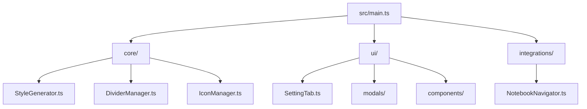

# 🎨 Colorful Folders | Developer Master Guide

> [!NOTE]
> Welcome to the internal engineering documentation for **Colorful Folders**. This guide provides a "clonable" understanding of the project—meaning that after reading these documents, a developer should be able to rebuild or extend the plugin from scratch.

---

## 🗺️ Navigation Map

| Section | Description | Key Focus |
| :--- | :--- | :--- |
| 🏗️ **[Architecture](docs/ARCHITECTURE.md)** | The "Engine" behind the styles | Traversal & Injection |
| 🗄️ **[Data Schema](docs/DATA_SCHEMA.md)** | Storage & Settings structure | Persistence |
| 🎨 **[Style Guide](docs/STYLE_GUIDE.md)** | Design tokens & CSS strategy | Aesthetics |
| 📖 **[API Reference](docs/API_REFERENCE.md)** | Class & Method documentation | Technical Specs |
| 🛠️ **[Contributing](docs/CONTRIBUTING.md)** | Feature implementation guide | Workflows |
| ⚙️ **[Engine Internals](docs/ENGINE_INTERNALS.md)** | Low-level logic & Debugging | Optimization |
| 🎬 **[Visual Effects](docs/VISUAL_EFFECTS.md)** | Static Effects & Shaders | Polish |
| 🎨 **[Customization](docs/CUSTOMIZATION.md)** | User-facing CSS overrides | Advanced Styles |
| 🛡️ **[Security Audit](docs/SECURITY_AUDIT.md)** | SVG Sanitization & Safety | XSS Protection |

---

## 🏛️ Core Pillars of Development

### 🚀 1. High-Performance CSS Engine
We never style elements directly in the loop. We use a **Static Style Injection Strategy**. 
*   **Mechanism**: Path-specific CSS rules.
*   **Execution**: Generated once, injected into a global `<style>` tag.
*   **Result**: Supports **20,000+ files** with zero UI lag.

### 🛡️ 2. "Sanitization-First" Security
User-provided SVGs and manual icon imports are handled by the `IconManager`.
*   **Process**: Robust DOM-based Sanitization.
*   **Safety**: Recursively strips `<script>`, `<iframe-`, and `on*` handlers.
*   **Reliability**: Parsed in a headless document environment.

### 🎨 3. Native Aesthetics
To feel like a "First-Class" part of Obsidian, we strictly follow the **Sentence Case** standard for all UI text.
*   **Standard**: `Enable automatic icons` ✅
*   **Standard**: `Enable Automatic Icons` ❌
*   **Enforcement**: Automated linting via `eslint-plugin-obsidianmd`.

### 🔄 4. Stability through Reconciliation
Components like **Dividers** use a "Virtual DOM Reconciliation" strategy in `DividerManager`.
*   **Strategy**: Diffing the current explorer state against desired configuration.
*   **Efficiency**: Minimal DOM updates to prevent stuttering.

---

## 🚀 Quick Start for Contributors

> [!TIP]
> Use `npm run dev` to start the watcher. It will automatically re-bundle the plugin on every save.

### Development Environment
1.  **Clone**: `git clone <repo-url>`
2.  **Install**: `npm install`
3.  **Build (Dev)**: `npm run dev`
4.  **Lint**: `npm run lint`

### Project Philosophy
- **Non-Destructive**: Never modify user files; all styling is transient.
- **Inheritance**: `getEffectiveStyle()` ensures children inherit parent themes.
- **Specificity**: Judicious use of `!important` to win over aggressive third-party themes.

---

## 📂 Project Structure

---

## 🛠️ Tech Stack
- **TypeScript**: Type-safe development.
- **esbuild**: Lightning-fast bundling.
- **Obsidian API**: Core framework integration.
- **MutationObserver**: Virtual explorer synchronization.
- **DOMParser API**: Secure SVG processing.

---

> [!IMPORTANT]
> This documentation is a living document. If you find gaps or implement new logic, please update the relevant files in the `/docs` directory.
