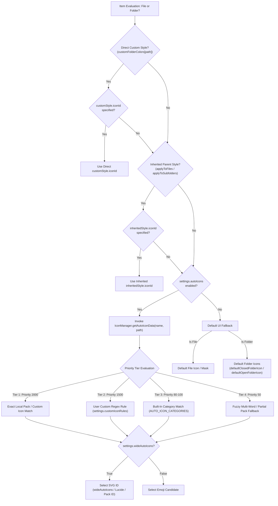

# Comprehensive Analysis: Icon Selection Process & Zero-DOM Rule Hierarchy

This document provides a technical breakdown of the icon selection algorithm implemented across [IconManager.ts](file:///r:/Obsidian/Testsub1/.obsidian/plugins/colorful-folders/src/core/IconManager.ts), [StyleResolver.ts](file:///r:/Obsidian/Testsub1/.obsidian/plugins/colorful-folders/src/core/StyleResolver.ts), and [StyleGenerator.ts](file:///r:/Obsidian/Testsub1/.obsidian/plugins/colorful-folders/src/core/StyleGenerator.ts).

---

## 1. High-Level Icon Selection Flowchart

---

## 2. Decision Matrix: File vs. Folder Icon Selection

The system differentiates between **File** items (`TFile`) and **Folder** items (`TFolder`) at both the style resolution phase ([StyleResolver.ts](file:///r:/Obsidian/Testsub1/.obsidian/plugins/colorful-folders/src/core/StyleResolver.ts)) and the CSS generation phase ([StyleGenerator.ts](file:///r:/Obsidian/Testsub1/.obsidian/plugins/colorful-folders/src/core/StyleGenerator.ts)).

| Feature / Behavior | Files (`TFile`) | Folders (`TFolder`) |
| :--- | :--- | :--- |
| **Direct Custom Style** | Uses `customStyle.iconId` | Uses `customStyle.iconId` |
| **Inherited Parent Style** | Inherits `inheritedStyle.iconId` **ONLY IF** parent style has `applyToFiles: true` | Inherits `inheritedStyle.iconId` **ONLY IF** ancestor style has `applyToSubfolders: true` |
| **Expanded / Open State** | Single static icon | Supports `expandedIconId` (or toggles between `defaultClosedFolderIcon` & `defaultOpenFolderIcon`) |
| **Auto-Icon Resolution** | Calls `getAutoIconData(child.name, child.path)` | Calls `getAutoIconData(child.name, child.path)` |
| **Default Fallback (Auto-Icon Disabled & No Custom Icon)** | Renders native file SVG mask (`CF_FILE_TEXT_ICON`) or standard file icon | Renders closed folder icon (`defaultClosedFolderIcon`, e.g. `lucide-folder`) & open folder icon (`defaultOpenFolderIcon`, e.g. `lucide-folder-open`) |
| **Wide vs Emoji Preference** | Controlled by `settings.wideAutoIcons` | Controlled by `settings.wideAutoIcons` |

---

## 3. Tiered Priority Hierarchy in `getAutoIconData()`

When `settings.autoIcons` is enabled and no explicit custom icon overrides exist, [IconManager.ts](file:///r:/Obsidian/Testsub1/.obsidian/plugins/colorful-folders/src/core/IconManager.ts) resolves the target icon using the following strictly ordered 4-tier pipeline:

### 🥇 Tier 1: Exact Local Pack / Custom Icon Name Match (Priority: 2000)
- **Target**: Compares the sanitized, hyphenated item title (`sanitized.replace(/[\s_]+/g, '-')`) directly against installed local SVG icon packs (in `.obsidian/icons`) and user custom icons (`settings.customIcons`).
- **Behavior**: If a file/folder named `github` matches `github.svg` (or `si-github`, `fa-github`), it immediately returns this icon with **Priority 2000**.

### 🥈 Tier 2: Custom User Regex Rules (Priority: 1500)
- **Target**: Evaluates user-defined rules configured in `settings.customIconRules` (e.g. `project.* = 🚀@1500` or `work = lucide-briefcase`).
- **Behavior**: Built dynamically into regular expressions (`new RegExp(pattern, 'i')`) and sorted ahead of built-in categories.

### 🥉 Tier 3: Built-In Category Rules (Priority: 80–100)
- **Target**: Evaluates category regexes in `AUTO_ICON_CATEGORIES` (e.g., `journal|daily|log`, `tech|code|dev`, `finance|money`).
- **Behavior**: Matches the item name against standard categories. If `settings.autoIconVariety` is enabled, a deterministic hash of the item name (`hashString(name)`) selects a varied emoji/Lucide icon from the category pool.

### 🏅 Tier 4: Fuzzy Multi-Word & Partial Pack Fallback (Priority: 50)
- **Target**: For multi-word file/folder names (e.g. `"Nintendo Switch 2 thoughts"`), filters out stop-words (`and`, `the`, `notes`, `thoughts`, `draft`, etc.) and tests:
  1. Two-word combinations (e.g. `"nintendo-switch"`).
  2. Individual brand/tool words (e.g. `"nintendo"`).
- **Behavior**: Acts as a final fallback with **Priority 50**, ensuring generic single-word pack matches do not hijack higher-priority user rules or category rules.

---

## 4. Zero-DOM Rendering Architecture

Under the Zero-DOM architecture, no physical HTML wrapper elements (`.cf-icon-wrapper`) are created in the DOM tree. Once `iconId` is resolved:

1. **Emoji Mode** (`isEmojiIcon(iconId) === true`):
   - Rendered via CSS `::before` pseudo-element with `content: "${iconId} "`.
2. **Lucide / Custom SVG Data URI Mode**:
   - SVG string retrieved via `getIconSvg(iconId, true)` and encoded into Data URIs.
   - Rendered via CSS `::before` pseudo-element using `-webkit-mask-image: url("data:image/svg+xml;utf8,...")` with `-webkit-mask-size: contain`.
3. **Flat Attribute Selection**:
   - Rules target `.nav-folder-title[data-cf-path="..."]` and `.nav-file-title[data-cf-path="..."]` dataset attributes stamped by `DOMObserverService`.

---

## 5. Summary of Key Files

- [IconManager.ts](file:///r:/Obsidian/Testsub1/.obsidian/plugins/colorful-folders/src/core/IconManager.ts): Implements `getAutoIconData()`, `findIconInPacks()`, `isEmojiIcon()`, and `getIconSvg()`.
- [AdoptedStyleSheetService.ts](file:///r:/Obsidian/Testsub1/.obsidian/plugins/colorful-folders/src/services/AdoptedStyleSheetService.ts): Manages constructable `CSSStyleSheet` lifecycle and multi-document adoption.
- [DOMObserverService.ts](file:///r:/Obsidian/Testsub1/.obsidian/plugins/colorful-folders/src/services/DOMObserverService.ts): Performs lightweight dataset attribute stamping (`data-cf-path`).
- [StyleResolver.ts](file:///r:/Obsidian/Testsub1/.obsidian/plugins/colorful-folders/src/core/StyleResolver.ts): Resolves effective style objects (`FolderStyle`) for individual files and folders.
- [StyleGenerator.ts](file:///r:/Obsidian/Testsub1/.obsidian/plugins/colorful-folders/src/core/StyleGenerator.ts): Generates high-performance flat CSS rules with SVG Data URIs for Obsidian's File Explorer and third-party integrations.
