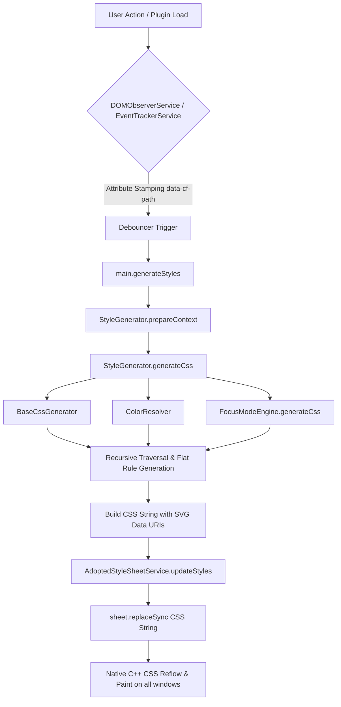
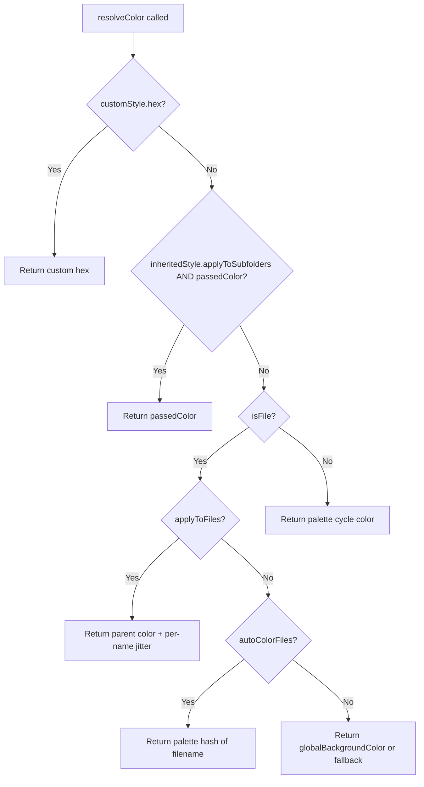

# 🏗️ Architecture Deep-Dive

This document explains the "Engine" of **Colorful Folders**: how it transforms an Obsidian vault into a vibrant, structured interface using a **Zero-DOM / `document.adoptedStyleSheets` Architecture**.

---

## 1. The Zero-DOM Rendering Cycle

Colorful Folders does **NOT** inject physical DOM wrapper elements (`.cf-icon-wrapper`, `.cf-interactive-divider`, `
`, `<svg>`) into Obsidian's file explorer tree. Instead, it relies on a **Zero-DOM / Adopted Stylesheet Strategy** combined with lightweight dataset attribute tagging (`data-cf-path`).

### Why?
1. **Third-Party Observer Race Condition Immunity (Incident #27)**: Injecting physical HTML nodes into Obsidian's file explorer tree triggers `childList` mutation events in third-party observers (such as *Smart Connections*), causing infinite observer feedback loops, layout thrashing, and element duplication.
2. **Native C++ Performance in Large Vaults**: Moving visual rendering (icons, colors, borders, section dividers) to the browser's native C++ CSS engine via `document.adoptedStyleSheets` bypasses DOM tree mutations and layout recalculation penalties in vaults with 10,000+ files.

---

### The Rendering Pipeline

### The Pipeline Steps:
1. **Attribute Tagging**: `DOMObserverService` stamps lightweight `data-cf-path="<path>"` dataset attributes on `.nav-folder-title`, `.nav-file-title`, and `.tree-item-self` elements. Because attribute updates do **not** trigger `childList` mutations, third-party observer race conditions are physically impossible.
2. **State Resolution**: `StyleResolver.getEffectiveStyle(target, plugin)` calculates the visual state for every folder/file.
3. **Flat Rule & Data URI CSS Generation**: `StyleGenerator.traverse()` builds flat CSS attribute rules (`.nav-folder-title[data-cf-path="..."]`). Custom SVGs and auto-icons are encoded into SVG Data URIs (`-webkit-mask-image: url("data:image/svg+xml;utf8,...")`) targeting `::before` pseudo-elements.
4. **Programmatic Stylesheet Adoption**: `AdoptedStyleSheetService` updates the programmatic `CSSStyleSheet` instance via `sheet.replaceSync(css)`. The sheet is attached directly to `document.adoptedStyleSheets` across all workspace windows without creating `<style>` elements or overwriting other plugins' sheets.
5. **Browser Execution**: The native browser CSS engine applies styles instantly with $O(1)$ overhead as items enter the viewport.

---

## 2. Color & Opacity Resolution (Modular Architecture)

All color, opacity, and text color math is centralized into `ColorResolver` (`src/core/ColorResolver.ts`).

### 2.1 `ColorResolver.resolveColor(...)` — The Color Priority Chain

Every item's final color is determined by this priority chain:

1. **Custom Style Override**: If the item's path has a `FolderStyle` with a `hex` value set, that color is used unconditionally.
2. **Inherited Subfolder Color**: If an ancestor has `applyToSubfolders: true` AND a `passedColor` (the ancestor's resolved color) is available, that color is returned directly.
3. **Inherited Subfolder Hex**: If inheritance is active but `passedColor` is not yet resolved, falls back to the ancestor's own `hex` value.
4. **File Color** (when `isFile: true`):
   - If `applyToFiles` is active on the inherited style, applies a per-name ±5-channel RGB jitter to the parent color for subtle variation.
   - If `autoColorFiles` or Notebook Navigator file-background is active, uses a hash of the filename against the palette.
   - Otherwise, falls back to `globalBackgroundColor`.
5. **Palette Cycle** (default for folders): Uses `(validIndex + depth + rootIndex + cycleOffset) % palette.length`.

---

### 2.2 `ColorResolver.resolveOpacity(...)` — Depth Progression

Opacity is determined by a fixed mathematical progression:

| Depth | Opacity | Formula |
|:---:|:---:|:---|
| 0 (Root) | **50%** | `rootOpacity ?? 0.50` |
| 1 | **40%** | `baseOp - (1 × 0.10)` |
| 2 | **30%** | `baseOp - (2 × 0.10)` |
| 3 | **20%** | `baseOp - (3 × 0.10)` |
| 4 | **10%** | `baseOp - (4 × 0.10)` |
| 5+ | **5%** | Hard floor — never invisible |

---

## 3. Zero-DOM Icon Resolution & Selection Logic

`IconManager` (`src/core/IconManager.ts`) handles icon resolution across **4 strict priority tiers**:

1. **Tier 1 (Priority 2000)**: Exact match in installed local filesystem packs (`.obsidian/icons`) or custom settings SVGs.
2. **Tier 2 (Priority 1500)**: Custom user regex rules from `settings.customIconRules`.
3. **Tier 3 (Priority 80–100)**: Built-in `AUTO_ICON_CATEGORIES` with optional variety hashing (`autoIconVariety`).
4. **Tier 4 (Priority 50)**: Multi-word and single-word brand/tool fallback in installed packs (`simple-icons`, `feather`, etc.).

### Auto-Download & Prioritization
On plugin startup or version change (`!settings.lastVersion` or `settings.lastVersion !== currentVersion`), essential open-source icon packs (`simple-icons` and `feather`) are auto-downloaded into `settings.customIcons` if missing. Installed custom icon packs receive high priority in `findIconInPacks()`.

---

## 4. Zero-DOM Section Divider Engine

`DividerManager` (`src/core/DividerManager.ts`) manages visual section dividers without prepending physical HTML nodes:
- Stamping dataset attributes (`data-cf-divider="true"`, `data-cf-path`) on target parent elements.
- Generating pure CSS pseudo-element rules (`::before` / `::after`) for bridge lines, pill labels, and gradient dividers.

---

## 5. AdoptedStyleSheet Lifecycle (`AdoptedStyleSheetService.ts`)

- Instantiates a programmatic `CSSStyleSheet` instance (`private sheet = new CSSStyleSheet();`).
- Attaches cleanly to `document.adoptedStyleSheets` for all active workspace windows on load without overwriting existing sheets (`doc.adoptedStyleSheets = [...doc.adoptedStyleSheets, this.sheet]`).
- Updates styles synchronously via `updateStyles(cssString)` -> `sheet.replaceSync(cssString)`.
- Detaches cleanly from `adoptedStyleSheets` in `onunload()`.
