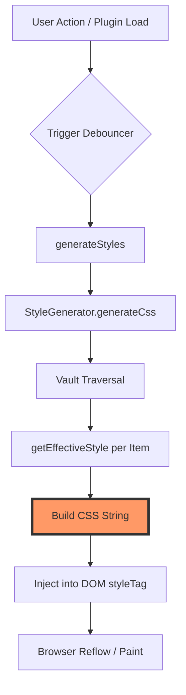

# 🏗️ Architecture Deep-Dive

This document explains the "Engine" of **Colorful Folders**: how it transforms a vault of markdown files into a vibrant, structured interface.

---

## 1. The Rendering Cycle

Colorful Folders does NOT style elements by finding them and setting `.style.color`. Instead, it uses a **Static Style Injection Strategy**.

> [!IMPORTANT]
> **Why this strategy?**
> Obsidian uses a **Virtualized List** for its File Explorer. Elements are created and destroyed dynamically as you scroll. Directly styling DOM elements would be slow and brittle. Instead, we generate CSS rules that target elements by their `data-path` attribute.

### The Rendering Pipeline



### The Cycle Breakdown:
1.  **Trigger**: User changes a setting or the plugin loads.
2.  **State Resolution**: `plugin.getEffectiveStyle()` calculates the visual state for every folder/file.
3.  **High-Performance Assembly**: `StyleGenerator.traverse()` builds a collection of CSS rules using the **"Collect-Join" Pattern** to prevent string concatenation overhead.
4.  **Injection**: The final joined string is pushed into `plugin.styleTag` in the `<head>`.
5.  **Browser Paint**: The browser's CSS engine applies the styles instantly as elements enter the viewport.

---

## 2. The "Effective Style" Algorithm

The "Brain" of the plugin is determining what color a folder should be. This happens in `ColorfulFoldersPlugin.getEffectiveStyle(target)`.

### Priority Hierarchy:
1.  **Direct Match**: Explicitly set in `settings.customFolderColors[path]`.
2.  **Parent Inheritance**: Ancestor with `applyToSubfolders: true`.
3.  **Dynamic Modes**: Heatmap, Monochromatic, or Sequential (Rainbow).
4.  **Default Fallback**: Active palette primary color.


---

## 3. StyleGenerator: The Recursive Engine

The `StyleGenerator` is a stateless class that walks the vault tree.

> [!NOTE]
> To handle 20,000+ files efficiently, we avoid creating objects inside the loop. We pass a shared `TraversalState` object through the recursion.

### Generated CSS Pattern:
```css
/* Folder Title Tint */
.nav-folder-title[data-path="Folder A"] {
    background-color: rgba(235, 111, 146, 0.548);
}

/* Container Tint (The space behind the files) */
.nav-folder-title[data-path="Folder A"] + .nav-folder-children {
    background-color: rgba(235, 111, 146, 0.028);
}

/* Icon Masking */
.nav-folder-title[data-path="Folder A"] .nav-folder-title-content::before {
    -webkit-mask-image: url('encoded-svg-here');
    background-color: #eb6f92;
}
```

---

## 4. Divider Manager: DOM Reconciliation

Dividers are the only part of the plugin that uses **Direct DOM Manipulation**. Because they are injected *between* native Obsidian elements, they cannot be handled by CSS alone.

### Reconciliation Loop:
`DividerManager.syncDividers()` is called whenever the explorer DOM changes.

> [!TIP]
> Reconciliation is debounced (usually 50ms) to prevent UI stuttering during rapid folder expansion.

1.  **Diff**: Compare desired dividers vs current DOM nodes (`.cf-interactive-divider`).
2.  **Sync**: 
    *   **Create**: Missing dividers are initialized.
    *   **Move**: Misplaced dividers are repositioned via `insertBefore`.
    *   **Purge**: Orphaned dividers are removed.

---

## 5. IconManager: Indestructible and Secure

The plugin uses a hybrid approach to ensure icons are performant, visually consistent, and 100% secure.

### CSS Masking (High Performance)
*   **Used for**: Auto-Icons, Folder Open/Closed states.
*   **Benefit**: Hundreds of icons can be rendered with zero DOM overhead.

### DOM Injection and Sanitization (Secure Overrides)
*   **Used for**: Manual Icon Overrides (Visual Picker) and external SVG strings.
*   **Mechanism**: Uses `DOMParser` and `XMLSerializer` for recursive sanitization.
*   **Security**: Strip `<script>`, `<iframe>`, and all `on*` event handlers.

---

## 6. Third-Party Integrations

We support **Notebook Navigator** by injecting specific selectors that target its custom list items (`.nn-navitem`). The logic is abstracted in `src/integrations/NotebookNavigator.ts` to ensure the core engine remains clean.

---

> [!CAUTION]
> Avoid modifying the `StyleGenerator`'s core traversal loop unless you are optimizing for big O complexity. Small regressions here can cause major performance drops in large vaults.
