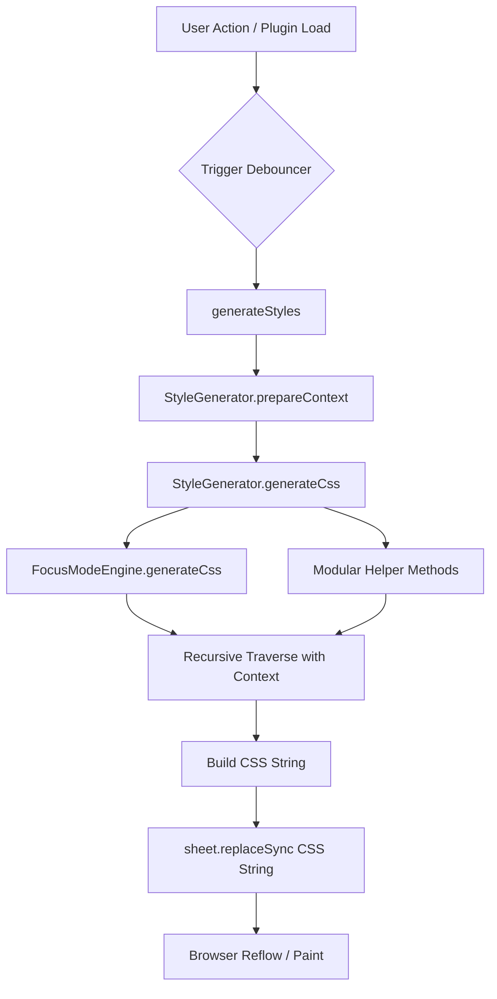
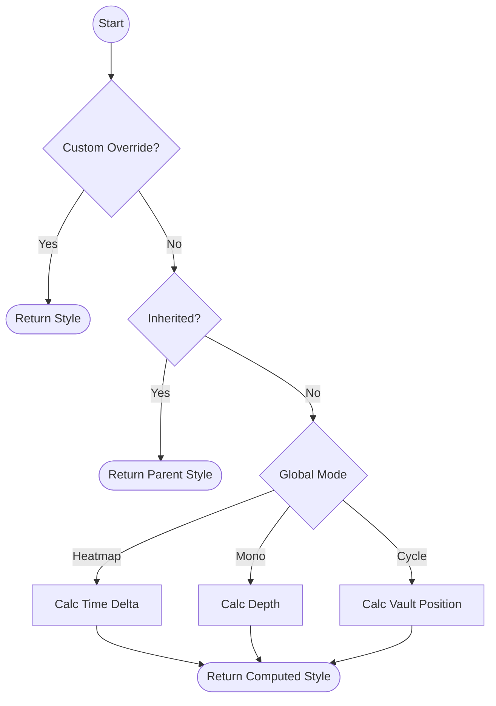

# 🏗️ Architecture Deep-Dive

This document explains the "Engine" of Colorful Folders: how it transforms a vault of markdown files into a vibrant, structured interface.

## 1. The Rendering Cycle

Colorful Folders does NOT style elements by finding them and setting `.style.color`. Instead, it uses a **Constructable Stylesheet Strategy**.

### Why?
Obsidian uses a **Virtualized List** for its File Explorer. This means elements are created and destroyed as you scroll. Directly styling DOM elements would be slow and brittle. Instead, we generate CSS rules that target elements by their `data-path` attribute.

We use the native browser `CSSStyleSheet` API (Constructable Stylesheets) via `document.adoptedStyleSheets`. This is functionally identical to a `<style>` tag but is the modern, secure standard and passes Obsidian's store linter.

### The Rendering Pipeline



### The Cycle:
1.  **Trigger**: User changes a setting or the plugin loads.
2.  **State Resolution**: `plugin.getEffectiveStyle()` calculates the visual state for every folder/file.
3.  **High-Performance CSS Generation**: `StyleGenerator.traverse()` builds a collection of CSS rules. To handle 20,000+ files efficiently, it uses the **"Collect-Join" Pattern** and **Persistent Memoization** (caching item counts and icon category rules) to minimize redundant computations.
4.  **Injection**: The final joined string is pushed via `plugin.sheet.replaceSync(css)` into the document's `adoptedStyleSheets`. No `<style>` element is created.
5.  **Browser handles the rest**: The browser's CSS engine applies the styles instantly as elements enter the viewport.

---

## 2. The "Effective Style" Algorithm

The most complex part of the plugin is determining what color a folder should be. This happens in `ColorfulFoldersPlugin.getEffectiveStyle(target)`.

### Logic Flow (Simplified):
```typescript
function getEffectiveStyle(target) {
    // 1. Check for Explicit Override
    if (settings.customFolderColors[target.path]) {
        return merge(defaults, settings.customFolderColors[target.path]);
    }

    // 2. Check for Inheritance
    let parent = target.parent;
    while (parent) {
        let parentStyle = settings.customFolderColors[parent.path];
        if (parentStyle && parentStyle.applyToSubfolders) {
            return parentStyle; // Inherit
        }
        parent = parent.parent;
    }

    // 3. Fallback to Global Generation Mode
    if (settings.colorMode === 'heatmap') {
        return computeHeatmapColor(target);
    } else if (settings.colorMode === 'monochromatic') {
        return computeDepthColor(target);
    } else {
        return computeSequentialColor(target);
    }
}
```

### Detailed Trace: `getEffectiveStyle`

This function is the "Brain" of the plugin. Here is the exact priority order it follows when determining a folder's color:

1.  **Direct Match**: Does `settings.customFolderColors[path]` exist?
2.  **Parent Inheritance**:
    *   Walk up the tree: `target.parent` -> `target.parent.parent`...
    *   For each ancestor, check if it has a custom style with `applyToSubfolders: true`.
    *   Stop at the first match.
3.  **Dynamic Modes**:
    *   **Heatmap**: Calculate `(now - lastModified)`. Map this duration to the palette index.
    *   **Monochromatic**: Use `depth % palette.length`. Apply lightness shift based on depth.
    *   **Cycle (Rainbow)**: Use `posIndex % palette.length`.
4.  **Default Fallback**: Return the primary color from the active palette.



---

### Modular Generation Pattern:
To maintain performance and maintainability, `generateCss` is an orchestrator that delegates to task-specific generators and peer modules:
1. **`generateGlobalBaseCss`**: Foundation layouts and foundational variables.
2. **`FocusModeEngine.generateCss`**: (External Module) Handles high-performance "Strict Spotlight" effects.
3. **`generateDividerCss`**: Global divider styles using `:has()` selectors.
4. **`generateStealthCss`**: Privacy layer rules.
5. **`traverse`**: The recursive engine that applies local styles to files and folders using the `StyleContext`.

### Traversal Logic:
The `StyleGenerator` utilizes persistent caches hosted on the main plugin instance to avoid expensive re-computations during traversal.

1.  **Item Count Cache**: Persists folder/file counts across renders, invalidated only on vault structural changes.
2.  **Icon Category Cache**: Memoizes compiled regex rules for auto-icons, rebuilt only when custom rules are modified.

### Structural Foundation (`styles.css`):
While `StyleGenerator` handles dynamic colors and icons, the core structural integrity is maintained by `styles.css`. This file provides the **Static Grid** (32px row height, 20px icon width) that ensures dynamic coloring doesn't cause layout shivering.

### Traversal Pseudocode:
```text
FUNCTION traverse(folder, currentDepth):
    FOR EACH item IN folder.children:
        style = plugin.getEffectiveStyle(item)
        generateSelector(item.path, style)
        
        IF item IS folder:
            traverse(item, currentDepth + 1)
```

### Generated CSS Pattern:
```css
/* Folder Title Tint */
.nav-folder-title[data-path="Folder A"] {
    background-color: rgba(235, 111, 146, 0.548);
}

/* Container Tint (The space behind the files) */
.nav-folder-title[data-path="Folder A"] + .nav-folder-children {
    background-color: rgba(235, 111, 146, 0.028);
}

/* Icon Masking */
.nav-folder-title[data-path="Folder A"] .nav-folder-title-content::before {
    -webkit-mask-image: url('encoded-svg-here');
    background-color: #eb6f92;
}
```

---

## 4. Divider Manager: DOM Reconciliation

Dividers are the only part of the plugin that uses **Direct DOM Manipulation**. Because they are injected *between* native Obsidian elements, they cannot be handled by CSS alone.

### Reconciliation Loop:
`DividerManager.syncDividers()` is called whenever the explorer DOM changes.
1.  **Diff**: It compares the list of folders that *should* have dividers against the list of elements currently in the DOM with the `cf-interactive-divider` class.
2.  **Sync**: 
    *   If a divider is missing, it is created and `insertBefore` is called.
    *   If a divider is in the wrong place (Obsidian reordered items), it is moved.
    *   If a divider is no longer needed, it is `remove()`-ed.

### Performance Tip:
Reconciliation is debounced (usually 50-100ms) to prevent UI stuttering during rapid folder expansion.

---

---

## 5. IconManager: The Indestructible & Secure Strategy

The plugin uses a hybrid approach to ensure icons are performant, visually consistent, and 100% secure.

### CSS Masking (High Performance)
*   **Used for**: Auto-Icons, Folder Open/Closed states.
*   **Mechanism**: `-webkit-mask-image` in `StyleGenerator.ts`.
*   **Caching**: Normalized SVG strings are cached in a **Categorical Memoization Layer** to prevent redundant DOM parsing during the traversal loop.
*   **Benefit**: Hundreds of icons can be rendered with zero DOM overhead.

### DOM Injection & Sanitization (Secure Overrides)
*   **Used for**: Manual Icon Overrides (Visual Picker) and external SVG strings.
*   **Mechanism**: `IconManager.ts` utilizes a **Robust DOM-based Sanitization Engine** (using `DOMParser` and `XMLSerializer`) instead of unsafe regex-based cleaning.
*   **Security**: All custom SVGs are parsed into a headless document where dangerous tags (like `<script>`) and event handlers (`onmouseover`, etc.) are stripped away before rendering.
*   **Benefit**: Eliminates potential XSS vulnerabilities while ensuring complex icons (with gradients or paths) render perfectly across all themes.

---

---

## 7. Stealth Mode: The Data Hider

Colorful Folders includes a "Stealth Mode" (Data Hider) to protect sensitive vault sections without requiring complex encryption.

### Security Model
*   **Hiding**: CSS rules automatically collapse and hide any folders/files that are marked as hidden in settings, controlled by the presence or absence of the `cf-show-hidden` class on the `<body>`.
*   **Persistence**: The vault lock state is managed in-memory to prevent leaking sensitivity after an Obsidian restart, while the list of hidden paths is persisted in `data.json`.

---

## 8. Third-Party Integrations: Notebook Navigator

We support **Notebook Navigator** through a specialized **"Native-Bridge" (Pure CSS)** architecture. This is handled by `src/integrations/NotebookNavigator.ts`.

### Why Pure CSS?
Notebook Navigator uses a **highly aggressive virtualized list**. DOM elements are created, recycled, and destroyed instantly as the user scrolls. 
- **The Problem**: Using JavaScript to inject classes or inline styles (like `IconManager` does for the native explorer) causes race conditions and visible flickering because the script can't keep up with the scroll speed.
- **The Solution**: The `StyleGenerator` generates static CSS rules that target items by their `data-path` (e.g., `.nn-navitem[data-path="Notes"]`). 
- **Performance**: This is **O(1)**. The browser's native CSS engine applies the styling the exact nanosecond React renders the row, ensuring 100% stable backgrounds and colors without any lag or scrolling artifacts.

### Integration Mechanism:
1.  **Selective Scoping**: Rules target `.nn-navitem` (folders) and `.nn-file` (files).
2.  **State Logic**: The generator correctly identifies the "Active" state in Notebook Navigator (`.is-active`) to apply custom selection glows and active file colors.
3.  **Icon Management**: While auto-icons use CSS `::before` masking, manual icon overrides are injected by `IconManager` into the `.nn-navitem-name` span, ensuring they move seamlessly with the text during scrolling.
---

## 9. Maintenance & Persistence

To keep the vault's styling engine healthy, Colorful Folders includes a **Maintenance Suite** in the "Database management" section of the settings.

### The Maintenance Tools
1.  **Stale Data Cleanup**: Scans `customFolderColors` and removes any entries whose paths no longer exist in the vault.
2.  **Selective Backups**: Generates type-specific `.json` exports (Folders vs. Dividers).
3.  **Intelligent Restore**: Merges external backup files into the active configuration using a **Safe-Spread Strategy**.

### Selective Backup Strategy
The plugin uses a **State Extraction** pattern to separate data during export:
-   **Folder Backup**: Creates a shallow copy of the state and `delete`s all keys prefixed with `divider` (e.g., `dividerText`, `hasDivider`).
-   **Divider Backup**: Iterates through the state and copies only entries where `hasDivider` is true, and only the `divider*` properties.

### Safe Restoration Logic
When restoring, the plugin performs a **Deep Property Merge**:
```typescript
this.plugin.settings.customFolderColors[key] = { ...existing, ...imported };
```
This ensures that restoring folder colors does not wipe out existing dividers, and vice versa.
