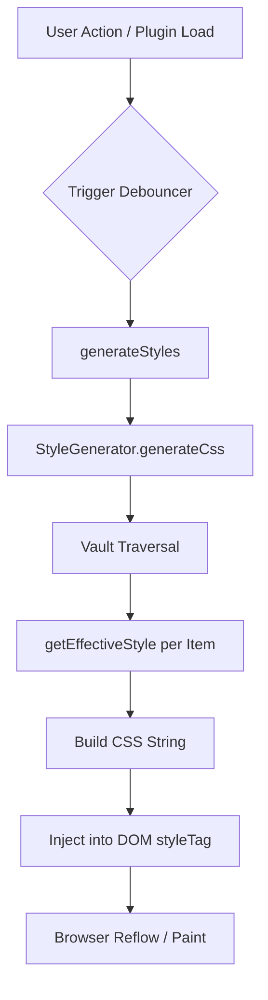

# 🏗️ Architecture Deep-Dive

This document explains the "Engine" of Colorful Folders: how it transforms a vault of markdown files into a vibrant, structured interface.

## 1. The Rendering Cycle

Colorful Folders does NOT style elements by finding them and setting `.style.color`. Instead, it uses a **Static Style Injection Strategy**.

### Why?
Obsidian uses a **Virtualized List** for its File Explorer. This means elements are created and destroyed as you scroll. Directly styling DOM elements would be slow and brittle. Instead, we generate CSS rules that target elements by their `data-path` attribute.

### The Rendering Pipeline



### The Cycle:
1.  **Trigger**: User changes a setting or the plugin loads.
2.  **State Resolution**: `plugin.getEffectiveStyle()` calculates the visual state for every folder/file.
3.  **CSS Generation**: `StyleGenerator.traverse()` builds a massive CSS string.
4.  **Injection**: The string is pushed into `plugin.styleTag` in the `<head>`.
5.  **Browser handles the rest**: The browser's CSS engine applies the styles instantly as elements enter the viewport.

---

## 2. The "Effective Style" Algorithm

The most complex part of the plugin is determining what color a folder should be. This happens in `ColorfulFoldersPlugin.getEffectiveStyle(target)`.

### Logic Flow (Simplified):
```typescript
function getEffectiveStyle(target) {
    // 1. Check for Explicit Override
    if (settings.customFolderColors[target.path]) {
        return merge(defaults, settings.customFolderColors[target.path]);
    }

    // 2. Check for Inheritance
    let parent = target.parent;
    while (parent) {
        let parentStyle = settings.customFolderColors[parent.path];
        if (parentStyle && parentStyle.applyToSubfolders) {
            return parentStyle; // Inherit
        }
        parent = parent.parent;
    }

    // 3. Fallback to Global Generation Mode
    if (settings.colorMode === 'heatmap') {
        return computeHeatmapColor(target);
    } else if (settings.colorMode === 'monochromatic') {
        return computeDepthColor(target);
    } else {
        return computeSequentialColor(target);
    }
}
```

### Detailed Trace: `getEffectiveStyle`

This function is the "Brain" of the plugin. Here is the exact priority order it follows when determining a folder's color:

1.  **Direct Match**: Does `settings.customFolderColors[path]` exist?
2.  **Parent Inheritance**:
    *   Walk up the tree: `target.parent` -> `target.parent.parent`...
    *   For each ancestor, check if it has a custom style with `applyToSubfolders: true`.
    *   Stop at the first match.
3.  **Dynamic Modes**:
    *   **Heatmap**: Calculate `(now - lastModified)`. Map this duration to the palette index.
    *   **Monochromatic**: Use `depth % palette.length`. Apply lightness shift based on depth.
    *   **Cycle (Rainbow)**: Use `posIndex % palette.length`.
4.  **Default Fallback**: Return the primary color from the active palette.


---

## 3. StyleGenerator: The Recursive Engine

The `StyleGenerator` is a stateless class that walks the vault tree.

### Traversal Pseudocode:
```text
FUNCTION traverse(folder, currentDepth):
    FOR EACH item IN folder.children:
        style = plugin.getEffectiveStyle(item)
        generateSelector(item.path, style)
        
        IF item IS folder:
            traverse(item, currentDepth + 1)
```

### Generated CSS Pattern:
```css
/* Folder Title Tint */
.nav-folder-title[data-path="Folder A"] {
    background-color: rgba(235, 111, 146, 0.548);
}

/* Container Tint (The space behind the files) */
.nav-folder-title[data-path="Folder A"] + .nav-folder-children {
    background-color: rgba(235, 111, 146, 0.028);
}

/* Icon Masking */
.nav-folder-title[data-path="Folder A"] .nav-folder-title-content::before {
    -webkit-mask-image: url('encoded-svg-here');
    background-color: #eb6f92;
}
```

---

## 4. Divider Manager: DOM Reconciliation

Dividers are the only part of the plugin that uses **Direct DOM Manipulation**. Because they are injected *between* native Obsidian elements, they cannot be handled by CSS alone.

### Reconciliation Loop:
`DividerManager.syncDividers()` is called whenever the explorer DOM changes.
1.  **Diff**: It compares the list of folders that *should* have dividers against the list of elements currently in the DOM with the `cf-interactive-divider` class.
2.  **Sync**: 
    *   If a divider is missing, it is created and `insertBefore` is called.
    *   If a divider is in the wrong place (Obsidian reordered items), it is moved.
    *   If a divider is no longer needed, it is `remove()`-ed.

### Performance Tip:
Reconciliation is debounced (usually 50-100ms) to prevent UI stuttering during rapid folder expansion.

---

---

## 5. IconManager: The Double-Rendering Strategy

The plugin uses a hybrid approach to ensure icons are both performant and indestructible.

### CSS Masking (High Performance)
*   **Used for**: Auto-Icons, Folder Open/Closed states.
*   **Mechanism**: `-webkit-mask-image` in `StyleGenerator.ts`.
*   **Benefit**: Hundreds of icons can be rendered with zero DOM overhead.

### DOM Injection (Indestructible Overrides)
*   **Used for**: Manual Icon Overrides (Visual Picker).
*   **Mechanism**: `IconManager.ts` physically inserts a `<span>` and hides the native theme icon.
*   **Benefit**: Bypass theme CSS conflicts and ensures the chosen icon is always visible.

---

---

## 7. Stealth Mode: The Data Hider

Colorful Folders includes a "Stealth Mode" (Data Hider) to protect sensitive vault sections without requiring complex encryption.

### Security Model
*   **Logic**: The plugin injects a global `.cf-stealth-active` class to the `<body>`.
*   **Hiding**: CSS rules automatically collapse and hide any folders/files that are not explicitly authorized by the user during the session.
*   **Persistence**: The vault lock state is managed in-memory to prevent leaking sensitivity after an Obsidian restart.

---

## 8. Third-Party Integrations

We support **Notebook Navigator** by injecting specific selectors that target its custom list items (`.nn-navitem`). The logic is abstracted in `src/integrations/NotebookNavigator.ts` to ensure the core engine remains clean.
