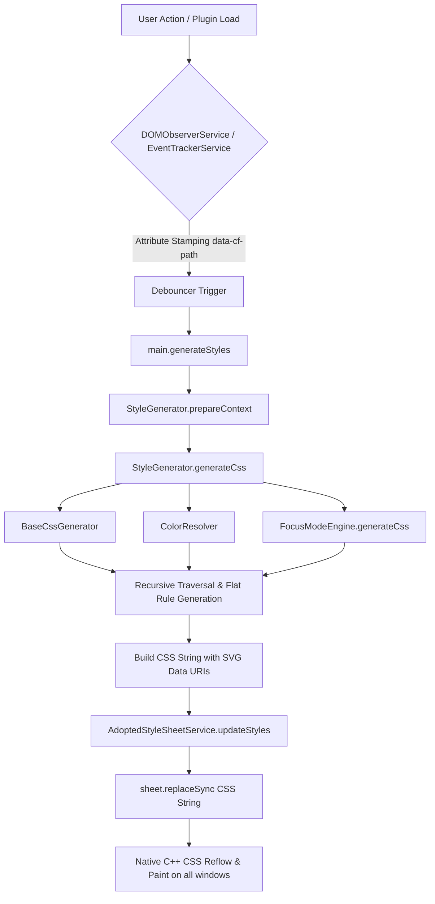
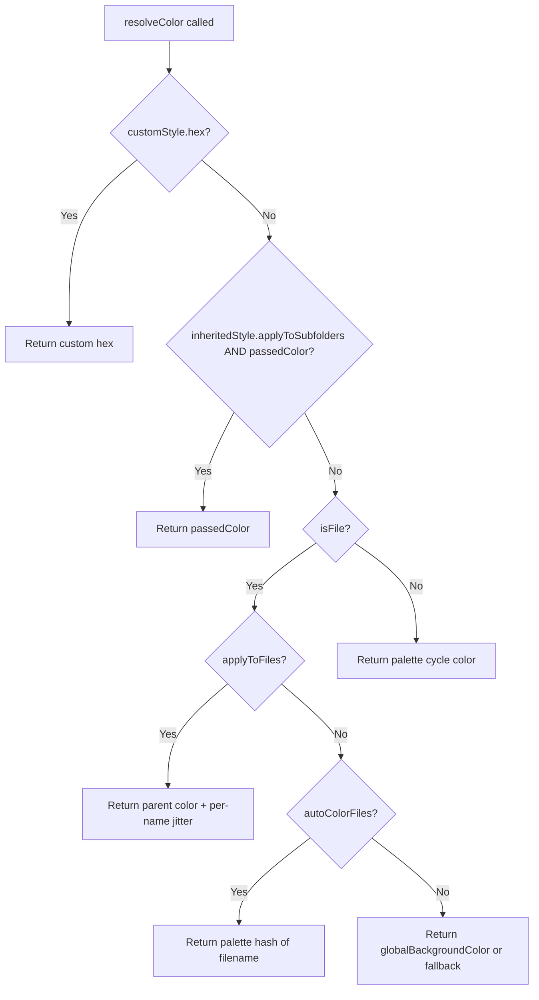
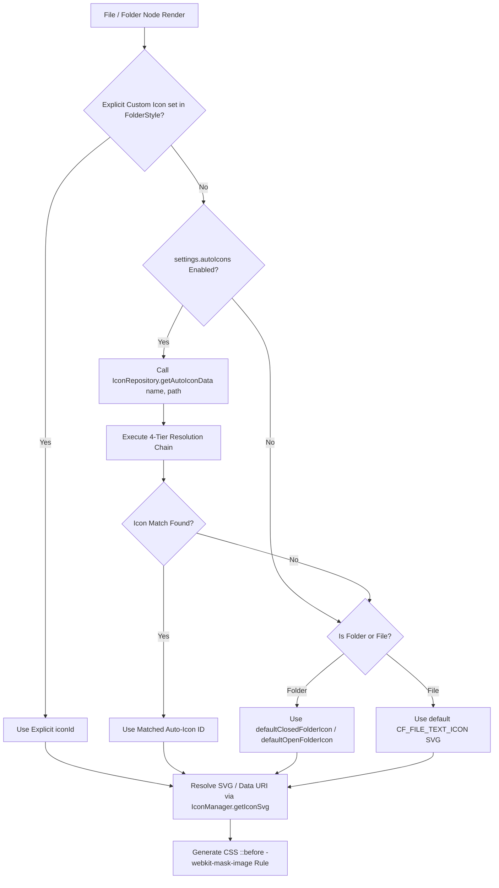
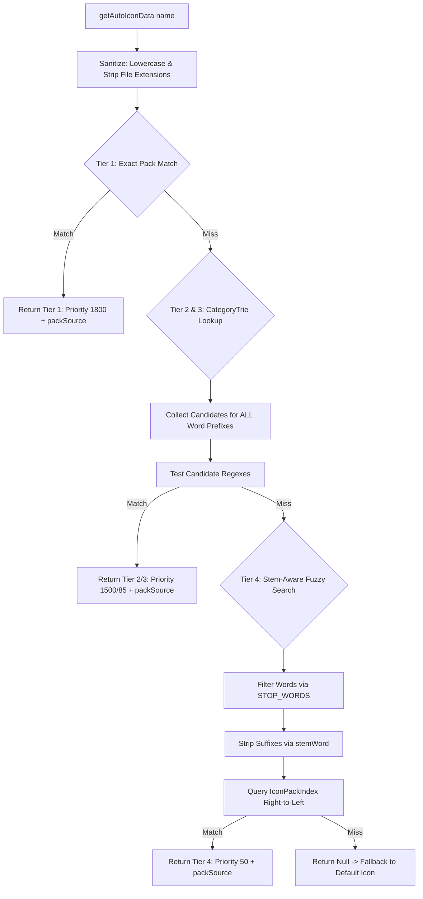

# 🏗️ Architecture Deep-Dive

This document explains the "Engine" of **Colorful Folders**: how it transforms an Obsidian vault into a vibrant, structured interface using a **Zero-DOM / `document.adoptedStyleSheets` Architecture**.

---

## 1. The Zero-DOM Rendering Cycle

Colorful Folders does **NOT** inject physical DOM wrapper elements (`.cf-icon-wrapper`, `.cf-interactive-divider`, `<div>`, `<svg>`) into Obsidian's file explorer tree. Instead, it relies on a **Zero-DOM / Adopted Stylesheet Strategy** combined with lightweight dataset attribute tagging (`data-cf-path`).

### Why?
1. **Third-Party Observer Race Condition Immunity (Incident #27)**: Injecting physical HTML nodes into Obsidian's file explorer tree triggers `childList` mutation events in third-party observers (such as *Smart Connections*), causing infinite observer feedback loops, layout thrashing, and element duplication.
2. **Native C++ Performance in Large Vaults**: Moving visual rendering (icons, colors, borders, section dividers) to the browser's native C++ CSS engine via `document.adoptedStyleSheets` bypasses DOM tree mutations and layout recalculation penalties in vaults with 10,000+ files.

---

### The Rendering Pipeline



### The Pipeline Steps:
1. **Attribute Tagging**: `DOMObserverService` stamps lightweight `data-cf-path="<path>"` dataset attributes on `.nav-folder-title`, `.nav-file-title`, and `.tree-item-self` elements. Because attribute updates do **not** trigger `childList` mutations, third-party observer race conditions are physically impossible.
2. **State Resolution**: `StyleResolver.getEffectiveStyle(target, plugin)` calculates the visual state for every folder/file.
3. **Flat Rule & Data URI CSS Generation**: `StyleGenerator.traverse()` builds flat CSS attribute rules (`.nav-folder-title[data-cf-path="..."]`). Custom SVGs and auto-icons are encoded into SVG Data URIs (`-webkit-mask-image: url("data:image/svg+xml;utf8,...")`) targeting `::before` pseudo-elements.
4. **Programmatic Stylesheet Adoption**: `AdoptedStyleSheetService` updates the programmatic `CSSStyleSheet` instance via `sheet.replaceSync(css)`. The sheet is attached directly to `document.adoptedStyleSheets` across all workspace windows without creating `<style>` elements or overwriting other plugins' sheets.
5. **Browser Execution**: The native browser CSS engine applies styles instantly with $O(1)$ overhead as items enter the viewport.

---

## 2. Color & Opacity Resolution (Modular Architecture)

All color, opacity, and text color math is centralized into `ColorResolver` (`src/core/ColorResolver.ts`).

### 2.1 `ColorResolver.resolveColor(...)` — The Color Priority Chain

Every item's final color is determined by this priority chain:

1. **Custom Style Override**: If the item's path has a `FolderStyle` with a `hex` value set, that color is used unconditionally.
2. **Inherited Subfolder Color**: If an ancestor has `applyToSubfolders: true` AND a `passedColor` (the ancestor's resolved color) is available, that color is returned directly.
3. **Inherited Subfolder Hex**: If inheritance is active but `passedColor` is not yet resolved, falls back to the ancestor's own `hex` value.
4. **File Color** (when `isFile: true`):
   - If `applyToFiles` is active on the inherited style, applies a per-name ±5-channel RGB jitter to the parent color for subtle variation.
   - If `autoColorFiles` or Notebook Navigator file-background is active, uses a hash of the filename against the palette.
   - Otherwise, falls back to `globalBackgroundColor`.
5. **Palette Cycle** (default for folders): Uses `(validIndex + depth + rootIndex + cycleOffset) % palette.length`.



---

### 2.2 `ColorResolver.resolveOpacity(...)` — Depth Progression

Opacity is determined by a fixed mathematical progression:

| Depth | Opacity | Formula |
|:---:|:---:|:---|
| 0 (Root) | **50%** | `rootOpacity ?? 0.50` |
| 1 | **40%** | `baseOp - (1 × 0.10)` |
| 2 | **30%** | `baseOp - (2 × 0.10)` |
| 3 | **20%** | `baseOp - (3 × 0.10)` |
| 4 | **10%** | `baseOp - (4 × 0.10)` |
| 5+ | **5%** | Hard floor — never invisible |

---

## 3. Tiered Icon Selection Engine Architecture

`IconManager` (`src/core/IconManager.ts`) coordinates icon resolution and CSS Data-URI generation for both **Folders** and **Files**.



### 3.1 Step-by-Step Selection Decision Flow

#### For Folders:
1. **Explicit Custom Override**: Checks `getStyle(folder.path)`. If `iconId` is set manually via the Color Picker or Style Modal, that icon is used unconditionally.
2. **Inherited Parent Icon**: If an ancestor folder has `applyToSubfolders: true` with an `iconId` set, that icon cascades to nested folders.
3. **Auto-Icon Resolution** (when `settings.autoIcons: true`): Queries `IconRepository.getAutoIconData(folder.name, folder.path)`.
4. **Default Folder Icon Fallback**: If no auto-icon matches, falls back to `settings.defaultClosedFolderIcon` / `settings.defaultOpenFolderIcon` (or native Obsidian collapse icons).

#### For Files:
1. **Explicit Custom File Override**: Checks `fileStyle.iconId` set on the specific file path.
2. **Inherited Folder File Icon**: Checks if parent folder has `inheritedStyle.applyToFiles: true` with an `iconId` set.
3. **Auto-Icon Resolution** (when `settings.autoIcons: true`): Queries `IconRepository.getAutoIconData(file.name, file.path)`.
4. **Default Document Fallback**: If no auto-icon matches, falls back to the default `CF_FILE_TEXT_ICON` document SVG.

---

### 3.2 The 4-Tier Resolution Chain (`IconRepository.ts`)



1. **Tier 1: Exact Pack Match (Priority 1800)**
   - Hyphenates the sanitized name (`"my_project.md"` $\rightarrow$ `"my-project"`).
   - Performs $O(1)$ query via `IconPackIndex.findIcon()`. Returns exact matching custom SVG or installed pack icon.

2. **Tier 2 & 3: Custom Regex Rules & Category Trie (Priority 1500 & 80–110)**
   - Queries `CategoryTrie.lookup(lName)` which collects candidate rules for the initial characters of **every word** in the title.
   - Evaluates custom user regex rules first (Tier 2, Priority 1500), then built-in `AUTO_ICON_CATEGORIES` (Tier 3, Priority 80–110).
   - If `autoIconVariety` is enabled, hashes `hashString(name)` against the category's `emojis` / `lucides` array to pick diverse icons.

3. **Tier 4: Stem-Aware Fuzzy Search (Priority 50)**
   - Tokenizes filename into words, filtering out question words, auxiliary verbs, and filler nouns via `STOP_WORDS`.
   - Strips suffixes (`-ing`, `-ed`, `-es`, `-s`) using `stemWord()`.
   - Queries multi-word pairs (`"word1-word2"`) and single words from **right to left** to give priority to main subject nouns over leading filler terms.

---

### 3.3 Pack Priority & Tie-Breaking (`PACK_PRIORITY`)

When suffix matches overlap across multiple installed packs (e.g. `github` in `simple-icons` vs `feather`), `IconPackIndex` breaks ties at index-build time using `PACK_PRIORITY`:

```typescript
export const PACK_PRIORITY: Record<string, number> = {
    'custom': 100,       // 1. Unique brand assets
    'lucide': 90,        // 2. Main UI baseline (Modern, sharp, highly consistent)
    'tabler': 80,        // 3. Main UI fallback (Massive library, same aesthetic)
    'simple-icons': 70,  // 4. Brands only (Logos for Google, GitHub, etc.)
    'remix': 60,         // 5. Secondary fallback
    'feather': 50,       // 6. Deprecated (Lucide upgraded version)
    'font-awesome': 40,  // 7. Utility fallback
    'material': 30       // 8. Geometric fallback
};
```

---

### 3.4 High-Performance LRU Caching (`src/common/LRUCache.ts`)

All SVG transformations and resolutions run through bounded $O(1)$ `LRUCache(2048)` instances:
- `_normCache`: Normalized SVG strings.
- `_dataUriCache`: Generated CSS Data-URIs.
- `_findPackIconCache`: Resolved pack icon IDs.
- `preNormalizeIcon()`: Eagerly pre-warms raw (`0:`) and encoded (`1:`) Data-URIs into memory on asset load.

---

## 4. Zero-DOM Section Divider Engine

`DividerManager` (`src/core/DividerManager.ts`) manages visual section dividers without prepending physical HTML nodes:
- Stamping dataset attributes (`data-cf-divider="true"`, `data-cf-path`) on target parent elements.
- Generating pure CSS pseudo-element rules (`::before` / `::after`) for bridge lines, pill labels, and gradient dividers.

---

## 5. AdoptedStyleSheet Lifecycle (`AdoptedStyleSheetService.ts`)

- Instantiates a programmatic `CSSStyleSheet` instance (`private sheet = new CSSStyleSheet();`).
- Attaches cleanly to `document.adoptedStyleSheets` for all active workspace windows on load without overwriting existing sheets (`doc.adoptedStyleSheets = [...doc.adoptedStyleSheets, this.sheet]`).
- Updates styles synchronously via `updateStyles(cssString)` -> `sheet.replaceSync(cssString)`.
- Detaches cleanly from `adoptedStyleSheets` in `onunload()`.
