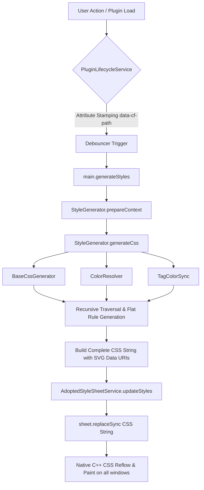
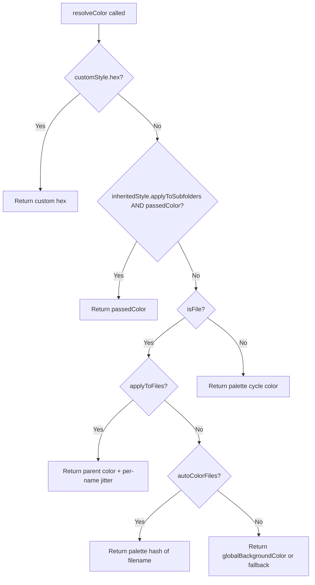
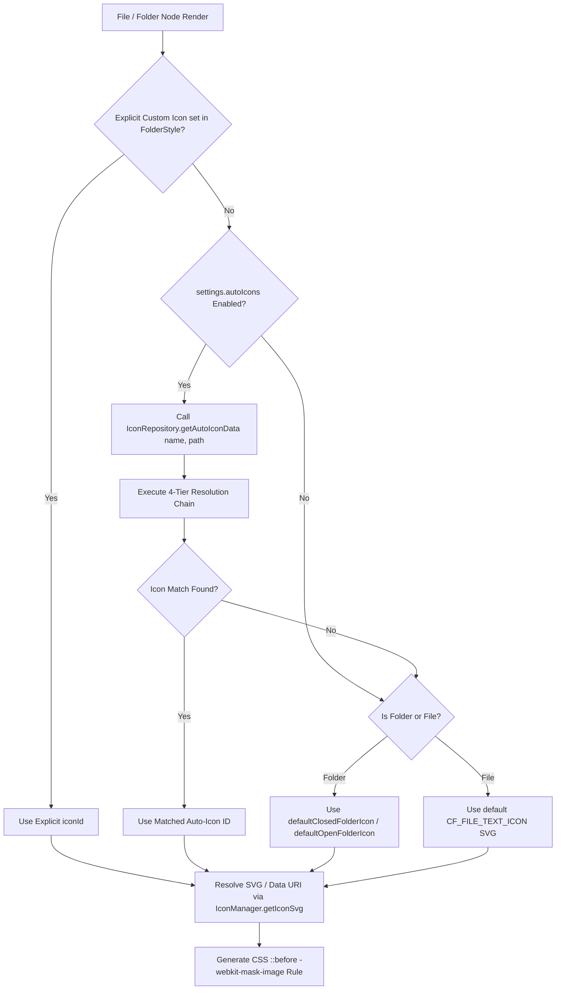
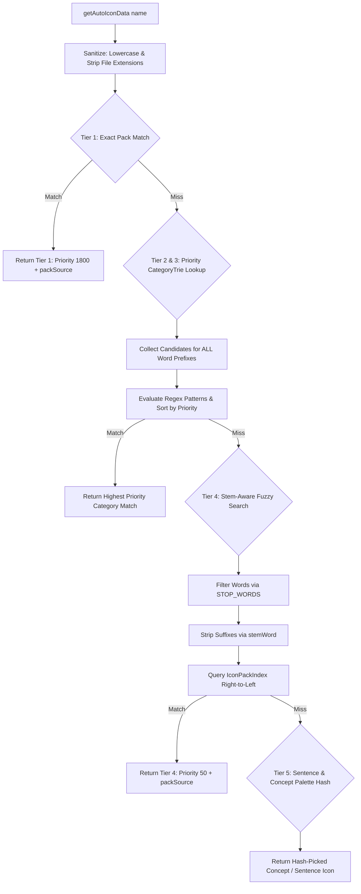
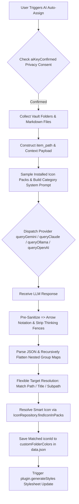
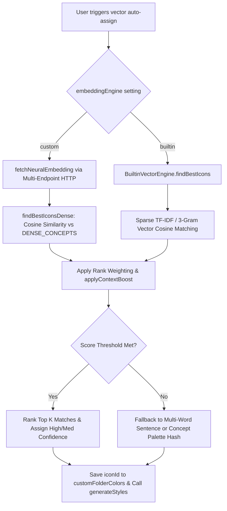

# 🏗️ Architecture Deep-Dive

This document explains the "Engine" of **Colorful Folders**: how it transforms an Obsidian vault into a vibrant, structured interface using a **Zero-DOM / `document.adoptedStyleSheets` Architecture**.

---

## 1. The Zero-DOM Rendering Cycle

Colorful Folders does **NOT** inject physical DOM wrapper elements (`.cf-icon-wrapper`, `.cf-interactive-divider`, `<div>`, `<svg>`) into Obsidian's file explorer tree. Instead, it relies on a **Zero-DOM / Adopted Stylesheet Strategy** combined with lightweight dataset attribute tagging (`data-cf-path`).

### Why?
1. **Third-Party Observer Race Condition Immunity (Incident #27)**: Injecting physical HTML nodes into Obsidian's file explorer tree triggers `childList` mutation events in third-party observers (such as *Smart Connections*), causing infinite observer feedback loops, layout thrashing, and element duplication.
2. **Native C++ Performance in Large Vaults**: Moving visual rendering (icons, colors, borders, section dividers) to the browser's native C++ CSS engine via `document.adoptedStyleSheets` bypasses DOM tree mutations and layout recalculation penalties in vaults with 10,000+ files.

---

### The Rendering Pipeline

### The Rendering Pipeline 


```mermaid
graph TD
    A[User Action / Plugin Load] --> B{PluginLifecycleService}
    B -->|Attribute Stamping data-cf-path| C[Debouncer Trigger]
    C --> D[main.generateStyles]
    D --> E[StyleGenerator.prepareContext]
    E --> F[StyleGenerator.generateCss]
    F --> G1[BaseCssGenerator]
    F --> G2[ColorResolver]
    F --> G3[TagColorSync]
    G1 --> H[Recursive Traversal & Flat Rule Generation]
    G2 --> H
    G3 --> H
    H --> I[Build Complete CSS String with SVG Data URIs]
    I --> J[AdoptedStyleSheetService.updateStyles]
    J --> K[sheet.replaceSync CSS String]
    K --> L[Native C++ CSS Reflow & Paint on all windows]
```

### The Pipeline Steps:
1. **Lifecycle Orchestration**: `PluginLifecycleService` manages event listeners (`create`, `modify`, `delete`, `window-open`, `layout-change`), document tracking across workspace windows, non-blocking layout ready hooks (~0ms startup lag), and teardown on unload. Vault modification listeners automatically detect external changes to `data.json` and custom icon files in `${configDir}/icons` for real-time PC and Mobile sync.
2. **Attribute Tagging**: `DOMObserverService` stamps lightweight `data-cf-path="<path>"` dataset attributes on `.nav-folder-title`, `.nav-file-title`, and `.tree-item-self` elements. Because attribute updates do **not** trigger `childList` mutations, third-party observer race conditions are physically impossible.
3. **State Resolution**: `StyleResolver.getEffectiveStyle(target, plugin)` calculates the visual state for every folder/file using `FolderTrie` for $O(\text{depth})$ path inheritance queries.
4. **Flat Rule & Data URI CSS Generation**: `StyleGenerator.traverse()` builds complete flat CSS attribute rules (`.nav-folder-title[data-cf-path="..."]`). Custom SVGs and auto-icons are encoded into SVG Data URIs (`-webkit-mask-image: url("data:image/svg+xml;utf8,...")`) targeting `::before` pseudo-elements.
5. **Programmatic Stylesheet Adoption**: `AdoptedStyleSheetService` updates the programmatic `CSSStyleSheet` instance via `sheet.replaceSync(css)`. The sheet is attached directly to `document.adoptedStyleSheets` across all workspace windows without creating `<style>` elements or overwriting other plugins' sheets.
6. **Browser Execution**: The native browser CSS engine applies styles instantly with $O(1)$ overhead as items enter the viewport.

---

### 1.1 Modular Local Icon Storage Architecture, Auto-Detection & Cache Optimizations

To protect vault synchronization (WebDAV, Obsidian Sync) from data loss and state resets caused by bloated `data.json` files when users download large icon packs:

1. **Decoupled Asset Storage**: Custom icons and downloaded icon packs are stored as discrete JSON files in `.obsidian/plugins/colorful-folders/icons/` (`custom-icons.json`, `[pack-prefix].json`). `data.json` remains lightweight (~5KB baseline).
2. **O(1) Template Node Cloning**: Modal UI elements (like `IconPickerModal`) use parsed SVG template element caching (`svgTemplateCache`) combined with native `templateSvg.cloneNode(true)` node cloning. This guarantees $O(1)$ DOM element construction and bypasses repeated `createContextualFragment` DOMParser invocations.
3. **Self-Check & Auto-Detection Engine**: `IconSettingSection` includes an automated self-check engine that scans local vault assets, detects all installed icon pack aliases (`tb-`, `si-`, `fa-`, `ri-`, local SVGs), repairs icon index registrations, and reports installed pack counts accurately.
4. **O(1) Non-Allocating Lookups**: High-frequency rendering routines call `plugin.getCustomIcon(id)` directly against `this.localCustomIcons` in memory. This eliminates millions of intermediate object property copies (`Object.assign({}, ...)`) during tree rendering and scrolling.
5. **Index & Cache Stability**:
   - `getCustomIconsMap()` returns a stable dictionary reference. This prevents `IconPackIndex.build()` from unnecessarily rebuilding search tries on every query.
   - `saveSettings()` compares reference stability and icon count, preventing `this.iconCache` from being thrashed and wiped on unrelated settings saves (e.g. opacity or line thickness tweaks).

---

## 2. Color & Opacity Resolution (Modular Architecture)

All color, opacity, and text color math is centralized into `ColorResolver` (`src/core/ColorResolver.ts`).

### 2.1 `ColorResolver.resolveColor(...)` — The Color Priority Chain & Color Modes

Every item's final color is determined by this priority chain and active `colorMode` (`cycle`, `monochromatic`, `hierarchy`, or `heatmap`):

1. **Custom Style Override**: If the item's path has a `FolderStyle` with a `hex` value set, that color is used unconditionally.
2. **Inherited Subfolder Color**: If an ancestor has `applyToSubfolders: true` AND a `passedColor` (the ancestor's resolved color) is available, that color is returned directly.
3. **Inherited Subfolder Hex**: If inheritance is active but `passedColor` is not yet resolved, falls back to the ancestor's own `hex` value.
4. **File Color** (when `isFile: true`):
   - Evaluated according to `fileColorMode` (`hierarchy`, `folder_scope`, `parent`, `sequential`, `mixed`, or `none`).
   - If `applyToFiles` is active on the inherited style, applies a per-name ±5-channel RGB jitter to the parent color for subtle variation.
   - If `autoColorFiles` or Notebook Navigator file-background is active, resolves file background according to `fileColorMode`.
   - Otherwise, falls back to `globalBackgroundColor`.
5. **Folder Color Generation Modes**:
   - **`hierarchy` (Hierarchy Level Mode)**: Each folder level's color is strictly determined by its nesting depth in the tree (`palette[(depth + cycleOffset) % palette.length]`). Uses `getFastFolderScopeDepth()` / `getFastPathSlashes()` for $O(1)$ zero-allocation depth calculations.
   - **`cycle` (Sequential Mode)**: Uses `(validIndex + depth + rootIndex + cycleOffset) % palette.length`.
   - **`monochromatic`**: Root folders pick sequential colors, and subfolders inherit their root folder's base color tint.
   - **`heatmap`**: Colors items based on modification age (`heatmapMtime`).

#### ⚡ Performance Optimization: Fast Path Slash Counting
To compute hierarchy depth without heap allocations or string splitting, `ColorResolver` uses a fast-path character scanner `getFastPathSlashes(path: string)`:
```typescript
export function getFastPathSlashes(path: string): number {
    let slashes = 0;
    const len = path.length;
    for (let i = 0; i < len; i++) {
        if (path.charCodeAt(i) === 47) { // '/' = 47
            slashes++;
        }
    }
    return slashes;
}
```
This avoids `path.split('/')` array allocations entirely, executing in $O(\text{path.length})$ CPU cycles with **0 bytes of memory allocations**.


```mermaid
graph TD
    A[resolveColor called] --> B{customStyle.hex?}
    B -- Yes --> Z1[Return custom hex]
    B -- No --> C{inheritedStyle.applyToSubfolders AND passedColor?}
    C -- Yes --> Z2[Return passedColor]
    C -- No --> D{isFile?}
    D -- Yes --> E{applyToFiles?}
    E -- Yes --> Z3[Return parent color + per-name jitter]
    E -- No --> F{autoColorFiles?}
    F -- Yes --> Z4[Return palette hash of filename]
    F -- No --> Z5[Return globalBackgroundColor or fallback]
    D -- No --> Z6[Return palette cycle color]
```

---

### 2.2 `ColorResolver.resolveOpacity(...)` — Depth Progression

Opacity is determined by a fixed mathematical progression:

| Depth | Opacity | Formula |
|:---:|:---:|:---|
| 0 (Root) | **50%** | `rootOpacity ?? 0.50` |
| 1 | **40%** | `baseOp - (1 × 0.10)` |
| 2 | **30%** | `baseOp - (2 × 0.10)` |
| 3 | **20%** | `baseOp - (3 × 0.10)` |
| 4 | **10%** | `baseOp - (4 × 0.10)` |
| 5+ | **5%** | Hard floor — never invisible |

---

## 3. Tiered Icon Selection Engine Architecture

`IconManager` (`src/core/IconManager.ts`) coordinates icon resolution and CSS Data-URI generation for both **Folders** and **Files**.


```mermaid
flowchart TD
    A[File / Folder Node Render] --> B{Explicit Custom Icon set in FolderStyle?}
    B -- Yes --> C[Use Explicit iconId]
    B -- No --> D{settings.autoIcons Enabled?}
    D -- No --> E{Is Folder or File?}
    E -- Folder --> F[Use defaultClosedFolderIcon / defaultOpenFolderIcon]
    E -- File --> G[Use default CF_FILE_TEXT_ICON SVG]
    D -- Yes --> H[Call IconRepository.getAutoIconData name, path]
    H --> I[Execute 4-Tier Resolution Chain]
    I --> J{Icon Match Found?}
    J -- Yes --> K[Use Matched Auto-Icon ID]
    J -- No --> E
    C --> L[Resolve SVG / Data URI via IconManager.getIconSvg]
    K --> L
    F --> L
    G --> L
    L --> M[Generate CSS ::before -webkit-mask-image Rule]
```

### 3.1 Step-by-Step Selection Decision Flow

#### For Folders:
1. **Explicit Custom Override**: Checks `getStyle(folder.path)`. If `iconId` is set manually via the Color Picker or Style Modal, that icon is used unconditionally.
2. **Inherited Parent Icon**: If an ancestor folder has `applyToSubfolders: true` with an `iconId` set, that icon cascades to nested folders.
3. **Auto-Icon Resolution** (when `settings.autoIcons: true`): Queries `IconRepository.getAutoIconData(folder.name, folder.path)`.
4. **Default Folder Icon Fallback**: If no auto-icon matches, falls back to `settings.defaultClosedFolderIcon` / `settings.defaultOpenFolderIcon` (or native Obsidian collapse icons).

#### For Files:
1. **Explicit Custom File Override**: Checks `fileStyle.iconId` set on the specific file path.
2. **Inherited Folder File Icon**: Checks if parent folder has `inheritedStyle.applyToFiles: true` with an `iconId` set.
3. **Auto-Icon Resolution** (when `settings.autoIcons: true`): Queries `IconRepository.getAutoIconData(file.name, file.path)`.
4. **Default Document Fallback**: If no auto-icon matches, falls back to the default `CF_FILE_TEXT_ICON` document SVG.

---

### 3.2 The 4-Tier Resolution Chain (`IconRepository.ts`)


```mermaid
graph TD
    A[getAutoIconData name] --> B[Sanitize: Lowercase & Strip File Extensions]
    B --> C{Tier 1: Exact Pack Match}
    C -- Match --> Z1[Return Tier 1: Priority 1800 + packSource]
    C -- Miss --> D{Tier 2 & 3: Priority CategoryTrie Lookup}
    D --> E[Collect Candidates for ALL Word Prefixes]
    E --> F[Evaluate Regex Patterns & Sort by Priority]
    F -- Match --> Z2[Return Highest Priority Category Match]
    F -- Miss --> G{Tier 4: Stem-Aware Fuzzy Search}
    G --> H[Filter Words via STOP_WORDS]
    H --> I[Strip Suffixes via stemWord]
    I --> J[Query IconPackIndex Right-to-Left]
    J -- Match --> Z3[Return Tier 4: Priority 50 + packSource]
    J -- Miss --> K{Tier 5: Sentence & Concept Palette Hash}
    K --> Z4[Return Hash-Picked Concept / Sentence Icon]
```

1. **Tier 1: Exact Pack Match (Priority 1800)**
   - Hyphenates the sanitized name (`"my_project.md"` $\rightarrow$ `"my-project"`).
   - Performs $O(1)$ query via `IconPackIndex.findIcon()`. Returns exact matching custom SVG or installed pack icon.

2. **Tier 2 & 3: Custom Regex Rules & Priority-Sorted Category Trie (Priority 1500 & 80–140)**
   - Queries `CategoryTrie.lookup(lName)` traversing a Node-based Prefix Trie (`TrieNode`) matching tokenized word prefixes.
   - All candidate category results are explicitly sorted by descending priority: `results.sort((a, b) => (b.priority || 0) - (a.priority || 0))`.
   - **Whole-Title & Mental Model Categories (Priority 110–140)**: Evaluates high-priority whole-title concept regexes before single-word categories:
     - **Ideation & Brainstorming** (Priority 140): `generate ideas`, `ideation`, `brainstorm` $\rightarrow$ `lightbulb`, `brain`, `sparkles`
     - **Mental Models & Growth** (Priority 130): `higher-order` (`layers`), `underestimate` (`hourglass`), `remember/mnemonic` (`brain`), `wu wei` (`sparkles`), `yin and yang` (`scale`), `vulnerability` (`heart`), `trust the process` (`compass`, `trending-up`), `use it or lose it` (`repeat`, `flame`)
     - **Habits & Routines** (Priority 125): `words...habits`, `habit` $\rightarrow$ `repeat`, `calendar-check`, `target`
     - **Narratives & Philosophy** (Priority 110–115): `quote`, `saying`, `journey`, `wander`, `story`, `agony` $\rightarrow$ `quote`, `compass`, `pen-tool`, `heart`
   - If `autoIconVariety` is enabled, hashes `hashString(name)` against the top matching category's `emojis` / `lucides` array to pick diverse icons.

3. **Tier 4: Stem-Aware Optimized Fuzzy Search (Priority 50)**
   - Executes fast-path O(1) query via `IconPackIndex.findIcon()`.
   - Performs length-difference pruning (`Math.abs(lenA - lenB) / maxLen > (1 - threshold)`).
   - Enforces word-boundary / prefix alignment checks to prevent false substring matches (e.g. "cat" inside "communication-category").
   - Calculates Levenshtein distance using a 1D single-row buffer to eliminate 2D array allocations.

4. **Tier 5: Multi-Word Sentence & Concept Palette Fallbacks (Priority 30)**
   - For multi-word file titles (`!isFolder && title.includes(' ') && length > 12`), hashes `hashString(filename)` across a curated **Sentence Palette** (`['compass', 'sparkles', 'lightbulb', 'quote', 'brain', 'pen-tool', 'book-open', 'repeat', 'heart', 'star']`).
   - For single-word file titles without category matches, hashes across a **Concept Palette** (`['sparkles', 'compass', 'pen-tool', 'lightbulb', 'brain', 'star', 'book-open', 'layers']`).

---

### 3.4 AI-Powered Icon Classification Service (`AIIconClassifier.ts`)

For intelligent, context-aware icon assignment across entire vaults, `AIIconClassifier` operates as an instance service (`plugin.aiIconClassifier`) coordinating LLM providers with `IconRepository`:


```mermaid
graph TD
    A[User Triggers AI Auto-Assign] --> B{Check aiKeyConfirmed Privacy Consent}
    B -- Confirmed --> C[Collect Vault Folders & Markdown Files]
    C --> D[Construct item_path & Context Payload]
    D --> E[Sample Installed Icon Packs & Build Category System Prompt]
    E --> F{Dispatch Provider queryGemini / queryClaude / queryOllama / queryOpenAI}
    F --> G[Receive LLM Response]
    G --> H[Pre-Sanitize => Arrow Notation & Strip Thinking Fences]
    H --> I[Parse JSON & Recursively Flatten Nested Group Maps]
    I --> J[Flexible Target Resolution: Match Path / Title / Subpath]
    J --> K[Resolve Smart Icon via IconRepository.findIconInPacks]
    K --> L[Save Matched iconId to customFolderColors in data.json]
    L --> M[Trigger plugin.generateStyles Stylesheet Update]
```

#### How AI Icon Assignment Works:
1. **Scope Selection & Payload**: Collects all vault folders and (if `aiIncludeFiles: true`) `.md` files, creating a clean `item_path` payload alongside tags, frontmatter, and content snippets.
2. **Whole-Title Semantic Analysis & Item Differentiation (System Prompt)**:
   - **`WHOLE-TITLE SEMANTIC ANALYSIS RULE`**: Instructs the LLM to evaluate multi-word titles, phrases, idioms, mental models, quotes, or philosophical concepts (e.g. *"Trust the process"*, *"Use it or Lose it"*, *"Vulnerability"*, *"Wu wei"*) **as a unified concept/mindset**.
   - Strictly forbids isolating individual words out of context (e.g., prevents assigning construction/wrench icons for "process" in *"Trust the process"*).
   - Instructs the AI model to output an array of 3 candidate icon names per item (`[Candidate 1: Specific/Brand, Candidate 2: Single-Word Visual, Candidate 3: General Fallback]`). Enforces structural container fallbacks for folders (`folder-code`, `layers`, `archive`, `folder`) and document fallbacks for files (`code`, `book`, `file-text`).
3. **Multi-Syntax Resilient Parsing**:
   - Pre-sanitizes non-standard `=>` and `->` arrow notation into standard JSON colons (`:`).
   - Strips `<think>` tags and markdown codeblocks via `parseJsonResponse()`.
   - Recursively flattens nested group/category maps (`unwrapOuterJsonObject`).
4. **Flexible Target Resolution**: Matches returned JSON keys against `batchTargets` via full path (`"x/x/Atlas.md"`), normalized path (`normalizePathKey`), filename/title (`"Atlas"`), or trailing path segment (`".../atlas"`).
5. **Sequential Candidate Evaluation & Tier Logging**: Iterates through candidates (`cand1` $\rightarrow$ `cand2` $\rightarrow$ `cand3`), validating against installed icon packs (`simple-icons`, `feather`, `remix`, `tabler`, `octicon`, `fa`, `lucide`) via `resolveSmartIcon`. Stops at the first installed icon, logs candidate tier wins in console, and falls back to native auto-icons if unmatched.
6. **Persistence & Instant Render**: Stores resolved `iconId` directly in `settings.customFolderColors[path].iconId`, calls `saveSettings()`, and updates document stylesheets immediately via `generateStyles()`.

---

### 3.5 Pack Priority & Tie-Breaking (`PACK_PRIORITY`)

When suffix matches overlap across multiple installed packs (e.g. `github` in `simple-icons` vs `feather`), `IconPackIndex` breaks ties at index-build time using `PACK_PRIORITY`:

```typescript
export const PACK_PRIORITY: Record<string, number> = {
    'custom': 100,       // 1. Unique brand assets
    'lucide': 90,        // 2. Main UI baseline (Modern, sharp, highly consistent)
    'tabler': 80,        // 3. Main UI fallback (Massive library, same aesthetic)
    'simple-icons': 70,  // 4. Brands only (Logos for Google, GitHub, etc.)
    'remix': 60,         // 5. Secondary fallback
    'feather': 50,       // 6. Deprecated (Lucide upgraded version)
    'font-awesome': 40,  // 7. Utility fallback
    'material': 30       // 8. Geometric fallback
};
```

---

### 3.4 High-Performance LRU Caching (`src/common/LRUCache.ts`)

All SVG transformations and resolutions run through bounded $O(1)$ `LRUCache(2048)` instances:
- `_normCache`: Normalized SVG strings.
- `_dataUriCache`: Generated CSS Data-URIs.
- `_findPackIconCache`: Resolved pack icon IDs.
- `preNormalizeIcon()`: Eagerly pre-warms raw (`0:`) and encoded (`1:`) Data-URIs into memory on asset load.

---

## 4. Zero-DOM Section Divider Engine

`DividerManager` (`src/core/DividerManager.ts`) manages visual section dividers without prepending physical HTML nodes:
- Stamping dataset attributes (`data-cf-divider="true"`, `data-cf-path`) on target parent elements.
- Generating pure CSS pseudo-element rules (`::before` / `::after`) for bridge lines, pill labels, and gradient dividers.

---

## 5. AdoptedStyleSheet Lifecycle (`AdoptedStyleSheetService.ts`)

- Instantiates a programmatic `CSSStyleSheet` instance (`private sheet = new CSSStyleSheet();`).
- Attaches cleanly to `document.adoptedStyleSheets` for all active workspace windows on load without overwriting existing sheets (`doc.adoptedStyleSheets = [...doc.adoptedStyleSheets, this.sheet]`).
- Updates styles synchronously via `updateStyles(cssString)` -> `sheet.replaceSync(cssString)`.
- Detaches cleanly from `adoptedStyleSheets` in `onunload()`.

---

## 6. Vector Embedding Classification Engine

The plugin includes an **offline-capable vector classification engine** operating independently of the LLM-based `AIIconClassifier`. It matches vault folder/file names to icon concepts using sparse and dense vector representations.

### 6.1 Engine Selection

Configured via `settings.embeddingEngine`:
- `"builtin"` — Uses the **zero-dependency built-in local vector model** (0mb download, embedded at compile time). Achieves <5ms per item classification using token weights, character 3-grams, and TF-IDF domain hints.
- `"custom"` — Delegates to a **local neural embedding model** (e.g. `bge-m3` via Ollama or a local OpenAI-compatible embedding API) for high semantic density.

### 6.2 Dense Neural Cosine Similarity & Concept Mapping (`findBestIconsDense`)

When custom neural embeddings are active:
1. **Multi-Endpoint HTTP Resiliency**: Automatically attempts `/api/embeddings`, `/api/embed`, and `/v1/embeddings` API routes with appropriate payloads (`{ model, prompt }` vs `{ model, input }`).
2. **Dense Concept Scoring (`DENSE_CONCEPTS`)**: Computes cosine similarity between the item's dense vector and predefined concept prompts (`quotes_wisdom`, `stories_writing`, `journey_voyage`, `imagination_vision`, `emotions_heart`, `coding`, `finance`, `tasks`, etc.).
3. **Rank Weighting & Context Boost**: Scales scores by candidate rank (`1.0 - idx * 0.1`) and applies `applyContextBoost` to reward filename/folder context alignment.


```mermaid
graph TD
    A[User triggers vector auto-assign] --> B{embeddingEngine setting}
    B -- builtin --> C[BuiltinVectorEngine.findBestIcons]
    B -- custom --> D[fetchNeuralEmbedding via Multi-Endpoint HTTP]
    D --> E[findBestIconsDense: Cosine Similarity vs DENSE_CONCEPTS]
    C --> F[Sparse TF-IDF / 3-Gram Vector Cosine Matching]
    E --> G[Apply Rank Weighting & applyContextBoost]
    F --> G
    G --> H{Score Threshold Met?}
    H -- Yes --> I[Rank Top K Matches & Assign High/Med Confidence]
    H -- No --> J[Fallback to Multi-Word Sentence or Concept Palette Hash]
    I --> K[Save iconId to customFolderColors & Call generateStyles]
    J --> K
```

### 6.3 Sentence & Concept Palette Deterministic Fallbacks

When vector similarity falls below the confidence threshold:
- **Multi-Word Sentence Titles** (`!isFolder && title.includes(' ') && length > 12`): Hashes the title across a curated **Sentence Palette** (`['compass', 'sparkles', 'lightbulb', 'quote', 'brain', 'pen-tool', 'book-open', 'repeat', 'heart', 'star']`).
- **Single-Word Concept Titles**: Hashes across a curated **Concept Palette** (`['sparkles', 'compass', 'pen-tool', 'lightbulb', 'brain', 'star', 'book-open', 'layers']`).

### 6.4 Notices & Progress

The engine reports progress via localized notices (`t("notice.vector_scanning")`, `t("notice.vector_progress")`, `t("notice.vector_success")`, `t("notice.vector_error")`). The button text in `AISettingSection.ts` dynamically updates from `t("settings.ai.btn_vector_auto_assign")` $\rightarrow$ `t("settings.ai.btn_vector_progress", { pct, completed, total })` during scanning.

---

## 7. Internationalization (i18n) Architecture

All user-facing strings across every setting panel, modal, notice, and tooltip are served through a **compile-time typed localization system**.

### 7.1 Key Components

| File | Role |
|:---|:---|
| `src/lang/helpers.ts` | `t()` translation function, `getLanguage()` detection, `localeMap` registry |
| `src/lang/locale/en.ts` | **Source of truth** — 624+ keys, all typed `as const` |
| `src/lang/locale/sk.ts` | Slovak (full coverage) |
| `src/lang/locale/de.ts` | German (full coverage) |
| `src/lang/locale/es.ts` | Spanish (full coverage) |
| `src/lang/locale/fr.ts` | French (full coverage) |
| `src/lang/locale/ja.ts` | Japanese (full coverage) |
| `src/lang/locale/zh-cn.ts` | Simplified Chinese (full coverage) |
| `src/lang/locale/zh-tw.ts` | Traditional Chinese / HK (full coverage) |

### 7.2 Type Safety Mechanism

```typescript
// TranslationKey is automatically derived from en.ts
export type TranslationKey = keyof typeof en;

// t() is strictly typed — wrong keys are caught at compile time
export function t(key: TranslationKey, vars?: Record<string, string | number>): string
```

Passing a string that is not a key in `en.ts` produces a TypeScript error at the `t()` call site — **no runtime surprises, no silent mismatches**.

### 7.3 Variable Interpolation

Template variables use `{{name}}` syntax:

```typescript
t("notice.vector_progress", { engineName: "Built-in", pct: 42, completed: 420, total: 1000 })
// → "⏳ Built-in: 42% (420/1000 items processed)..."
```

For full documentation: [`docs/LOCALIZATION.md`](file:///r:/Obsidian/Testsub1/.obsidian/plugins/colorful-folders/docs/LOCALIZATION.md).

