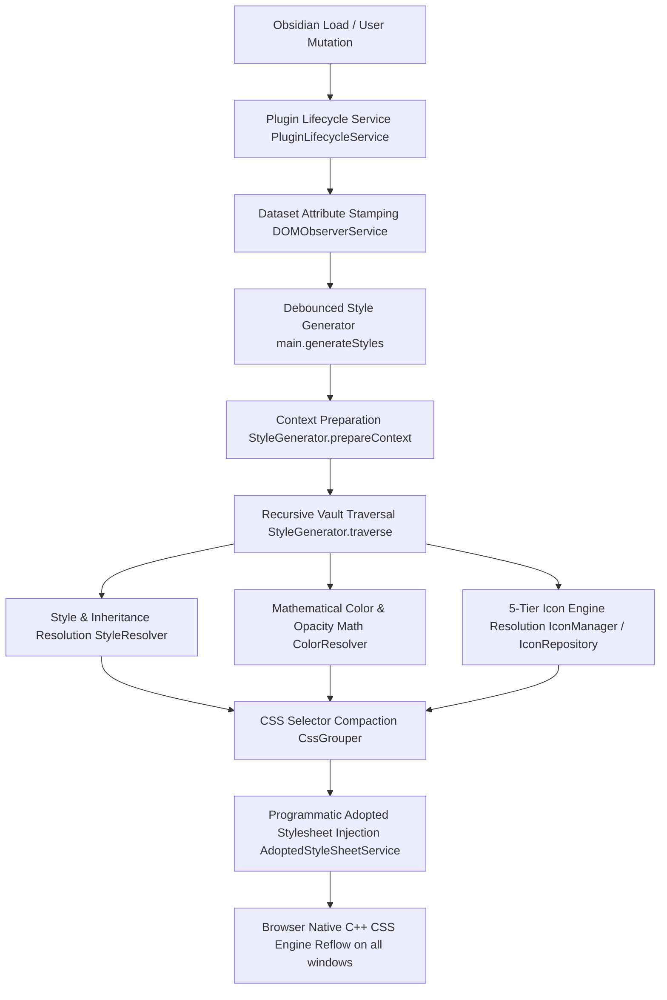
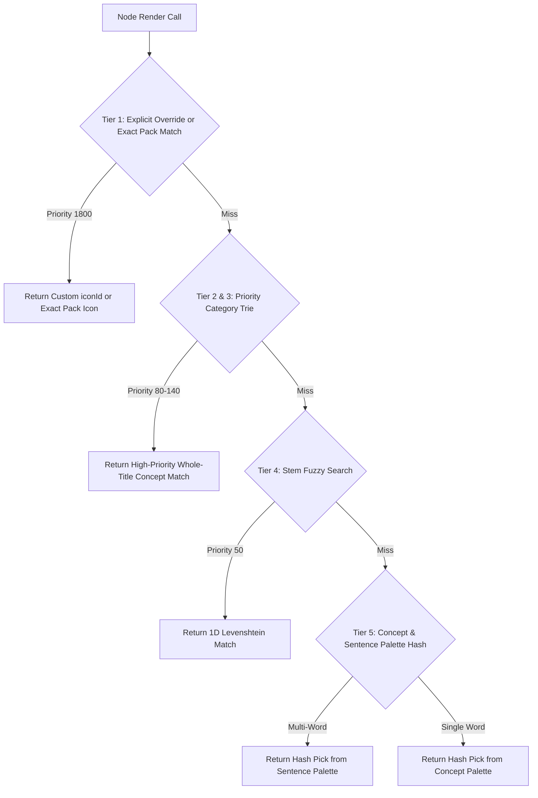

# 📖 The Ultimate Colorful Folders Codebase & Architecture Guide

Welcome to the comprehensive technical documentation for **Colorful Folders**. This document explains **how the plugin works under the hood**, how data flows from storage to rendering, and provides a detailed breakdown of all **51 TypeScript source files** across the 6 core architectural subsystems.

---

## 🏗️ 1. Architecture Overview & High-Level Execution Flow

Colorful Folders operates on a **Zero-DOM Adopted Stylesheet Engine**. Instead of injecting physical HTML wrapper elements into Obsidian's File Explorer tree (which triggers observer race conditions with other plugins), it stamps lightweight dataset attributes (`data-cf-path`) on native elements and injects flat CSS rules into programmatic `CSSStyleSheet` instances attached to `document.adoptedStyleSheets`.

---

## 📂 2. Comprehensive Subsystem & File Reference (51 TypeScript Files)

### 2.1 Core Subsystem (`src/core/`)

This directory contains the primary rendering engine, styling resolution math, icon matching, section divider logic, and CSS rule compaction.

| File | Purpose & Responsibilities | Key Functions / Methods |
| :--- | :--- | :--- |
| [StyleGenerator.ts](file:///r:/Obsidian/Testsub1/.obsidian/plugins/colorful-folders/src/core/StyleGenerator.ts) | Master styling orchestrator. Recursively traverses the vault file tree (`traverse()`), compiles execution context (`prepareContext()`), resolves item colors/icons, and builds compacted CSS strings. | `traverse()`, `prepareContext()`, `generateCss()`, `isValidIconStr()` |
| [StyleResolver.ts](file:///r:/Obsidian/Testsub1/.obsidian/plugins/colorful-folders/src/core/StyleResolver.ts) | Determines effective styles for notes and folders, evaluating user overrides, subfolder inheritance, and file cascading. Leverages `customFolderColorsMap` for $O(1)$ lookups. | `getStyle()`, `getEffectiveStyle()` |
| [ColorResolver.ts](file:///r:/Obsidian/Testsub1/.obsidian/plugins/colorful-folders/src/core/ColorResolver.ts) | Core mathematical color and opacity progression engine. Computes colors for `hierarchy`, `cycle`, `monochromatic`, and `heatmap` modes, calculates WCAG contrast, and applies depth opacity decay. | `resolveColor()`, `resolveOpacity()`, `resolveTextColor()`, `getCurrentPalette()`, `getFastPathSlashes()` |
| [BaseCssGenerator.ts](file:///r:/Obsidian/Testsub1/.obsidian/plugins/colorful-folders/src/core/BaseCssGenerator.ts) | Generates global layout rules, stealth mode styles, active glow effects, and pseudo-element section divider lines (`::before` / `::after`). | `generateGlobalBaseCss()`, `generateDividerCss()`, `generateStealthCss()` |
| [CssGrouper.ts](file:///r:/Obsidian/Testsub1/.obsidian/plugins/colorful-folders/src/core/CssGrouper.ts) | High-performance CSS rule deduplication engine. Groups identical style declarations by selector signature keys and chunks selectors into groups of 500 to prevent browser selector limits. | `add()`, `addRaw()`, `build()` |
| [RainbowManager.ts](file:///r:/Obsidian/Testsub1/.obsidian/plugins/colorful-folders/src/core/RainbowManager.ts) | Multi-stop neon rainbow and text gradient generator. Creates theme-aware linear-gradient rules for title text with contrast boosting and bounded `LRUCache(1024)` memoization. | `buildGradientCss()`, `resolveRootSpectrum()`, `resolveCustomStops()` |
| [DividerManager.ts](file:///r:/Obsidian/Testsub1/.obsidian/plugins/colorful-folders/src/core/DividerManager.ts) | Section divider manager. Stamps dataset attributes (`data-cf-divider`, `data-cf-path`) on target parent items without modifying physical child nodes. | `syncDividers()`, `hasAnyDividers()`, `clean()` |
| [IconManager.ts](file:///r:/Obsidian/Testsub1/.obsidian/plugins/colorful-folders/src/core/IconManager.ts) | Public facade API for the icon engine. Delegates SVG fetching, Data-URI generation, and icon validation to `IconRepository`. | `getAutoIconData()`, `getIconSvg()`, `getDataUri()`, `isValidIcon()`, `preNormalizeIcon()` |
| [IconRepository.ts](file:///r:/Obsidian/Testsub1/.obsidian/plugins/colorful-folders/src/core/IconRepository.ts) | Coordinates the 5-Tier icon resolution engine. Manages 5 bounded LRU caches (`_normCache`, `_dataUriCache`, `_findPackIconCache`, `_autoIconResultCache`, `_iconValidityCache`) for zero-allocation SVG operations. | `getAutoIconData()`, `getIconSvg()`, `isValidIcon()`, `findIconInPacks()` |
| [CategoryTrie.ts](file:///r:/Obsidian/Testsub1/.obsidian/plugins/colorful-folders/src/core/CategoryTrie.ts) | Node-based Prefix Trie (`TrieNode`) matching tokenized words against character prefix branches. Pre-sorts categories by priority at build time for instant $O(N)$ priority returns. | `build()`, `lookup()`, `insertWord()` |
| [IconPackIndex.ts](file:///r:/Obsidian/Testsub1/.obsidian/plugins/colorful-folders/src/core/IconPackIndex.ts) | Icon pack registry and search engine. Manages custom & installed packs (Lucide, Simple Icons, Tabler, FontAwesome), breaks ties using `PACK_PRIORITY`, and performs stem-aware 1D Levenshtein fuzzy search. | `registerPack()`, `findIcon()`, `searchFuzzy()` |

---

### 2.2 Services Subsystem (`src/services/`)

Services manage workspace window integration, background DOM observation, event tracking, and adopted stylesheet application.

| File | Purpose & Responsibilities | Key Functions / Methods |
| :--- | :--- | :--- |
| [PluginLifecycleService.ts](file:///r:/Obsidian/Testsub1/.obsidian/plugins/colorful-folders/src/services/PluginLifecycleService.ts) | Coordinates plugin initialization, multi-window hooks (`window-open`), document tracking, layout ready hooks, and clean teardown on unload. | `init()`, `onLayoutReady()`, `registerWindowHooks()`, `unload()` |
| [DOMObserverService.ts](file:///r:/Obsidian/Testsub1/.obsidian/plugins/colorful-folders/src/services/DOMObserverService.ts) | Stamps lightweight `data-cf-path` dataset attributes on explorer nodes. Monitors document body class changes (`theme-dark`, `theme-light`) while preventing observer loops with third-party plugins. | `initStyleObservers()`, `tagExplorerItems()`, `initDividerObserver()`, `handleScroll()` |
| [EventTrackerService.ts](file:///r:/Obsidian/Testsub1/.obsidian/plugins/colorful-folders/src/services/EventTrackerService.ts) | Listens to vault events (`create`, `modify`, `delete`, `rename`). Automatically updates `customFolderColorsMap` keys on path renames and tracks active files across all workspace documents. | `registerVaultEvents()`, `registerActiveFileTracker()`, `updateActiveDocumentState()` |
| [AdoptedStyleSheetService.ts](file:///r:/Obsidian/Testsub1/.obsidian/plugins/colorful-folders/src/services/AdoptedStyleSheetService.ts) | Manages programmatic `CSSStyleSheet` instances attached directly to `document.adoptedStyleSheets` across all workspace windows for zero-DOM layout reflowing. | `updateStyles()`, `attachToDocument()`, `detachFromDocument()`, `unload()` |

---

### 2.3 Vector & AI Integrations Subsystem (`src/integrations/`)

Integrations provide intelligent AI classification, offline vector matching, graph sync, tag sync, and third-party plugin styling.

| File | Purpose & Responsibilities | Key Functions / Methods |
| :--- | :--- | :--- |
| [embedingmodel.ts](file:///r:/Obsidian/Testsub1/.obsidian/plugins/colorful-folders/src/integrations/embedingmodel.ts) | Offline vector classification engine. Implements built-in sparse TF-IDF 3-gram vector matching and `Float32Array` SIMD dense neural cosine similarity (`findBestIconsDense`) with multi-endpoint HTTP fallbacks (`/api/embeddings`, `/v1/embeddings`) and Sentence/Concept Palettes. | `findBestIcons()`, `findBestIconsDense()`, `fetchNeuralEmbedding()`, `computeDenseCosineSimilarity()` |
| [AIIconClassifier.ts](file:///r:/Obsidian/Testsub1/.obsidian/plugins/colorful-folders/src/integrations/AIIconClassifier.ts) | Online LLM auto-assignment service. Coordinates Gemini, Claude, OpenAI, and Ollama providers with candidate resolution, enforcing the `WHOLE-TITLE SEMANTIC ANALYSIS RULE` and sanitizing response payloads. | `classifyVault()`, `constructSystemPrompt()`, `parseJsonResponse()`, `resolveSmartIcon()` |
| [NotebookNavigator.ts](file:///r:/Obsidian/Testsub1/.obsidian/plugins/colorful-folders/src/integrations/NotebookNavigator.ts) | Integration for the *Notebook Navigator* community plugin. Generates specialized CSS rules for note titles, font weights, background colors, and icon alignment. | `generateCss()`, `showFileBg()` |
| [GraphColorSync.ts](file:///r:/Obsidian/Testsub1/.obsidian/plugins/colorful-folders/src/integrations/GraphColorSync.ts) | Synchronizes vault folder colors with Obsidian's native 2D/3D Graph View nodes. | `syncGraphColors()` |
| [TagColorSync.ts](file:///r:/Obsidian/Testsub1/.obsidian/plugins/colorful-folders/src/integrations/TagColorSync.ts) | Generates dynamic CSS rules for colored tags (`#tag`) across notes and editor views. | `generateTagCss()` |

---

### 2.4 Internationalization Subsystem (`src/lang/`)

Compile-time type-safe multi-language system providing complete localization.

| File | Purpose & Responsibilities |
| :--- | :--- |
| [helpers.ts](file:///r:/Obsidian/Testsub1/.obsidian/plugins/colorful-folders/src/lang/helpers.ts) | Provides the strictly typed `t(key, vars)` translation helper, detects active Obsidian locale, and falls back to English. |
| [en.ts](file:///r:/Obsidian/Testsub1/.obsidian/plugins/colorful-folders/src/lang/locale/en.ts) | **Source of truth** language dictionary (`as const`). Defines 620+ translation keys. |
| [de.ts](file:///r:/Obsidian/Testsub1/.obsidian/plugins/colorful-folders/src/lang/locale/de.ts) | German localization dictionary. |
| [es.ts](file:///r:/Obsidian/Testsub1/.obsidian/plugins/colorful-folders/src/lang/locale/es.ts) | Spanish localization dictionary. |
| [fr.ts](file:///r:/Obsidian/Testsub1/.obsidian/plugins/colorful-folders/src/lang/locale/fr.ts) | French localization dictionary. |
| [ja.ts](file:///r:/Obsidian/Testsub1/.obsidian/plugins/colorful-folders/src/lang/locale/ja.ts) | Japanese localization dictionary. |
| [sk.ts](file:///r:/Obsidian/Testsub1/.obsidian/plugins/colorful-folders/src/lang/locale/sk.ts) | Slovak localization dictionary. |
| [zh-cn.ts](file:///r:/Obsidian/Testsub1/.obsidian/plugins/colorful-folders/src/lang/locale/zh-cn.ts) | Simplified Chinese localization dictionary. |
| [zh-tw.ts](file:///r:/Obsidian/Testsub1/.obsidian/plugins/colorful-folders/src/lang/locale/zh-tw.ts) | Traditional Chinese localization dictionary. |

---

### 2.5 Common Utilities & Constants Subsystem (`src/common/`)

Shared utility functions, data structures, and type definitions.

| File | Purpose & Responsibilities | Key Functions / Structs |
| :--- | :--- | :--- |
| [LRUCache.ts](file:///r:/Obsidian/Testsub1/.obsidian/plugins/colorful-folders/src/common/LRUCache.ts) | Generic bounded $O(1)$ Least Recently Used cache implementation. Uses zero-allocation `.keys().next().value` eviction. | `get()`, `set()`, `has()`, `clear()` |
| [utils.ts](file:///r:/Obsidian/Testsub1/.obsidian/plugins/colorful-folders/src/common/utils.ts) | Performance-critical utility functions: fast-path `safeEscape()`, fast-path `normalizeVaultPath()`, `hexToRgbObj()`, and RGB brightness adjustments. | `safeEscape()`, `normalizeVaultPath()`, `hexToRgbObj()`, `parseCustomPalette()` |
| [VaultUtils.ts](file:///r:/Obsidian/Testsub1/.obsidian/plugins/colorful-folders/src/common/VaultUtils.ts) | Vault helper functions for counting child files and subfolders in background tasks. | `countItems()` |
| [constants.ts](file:///r:/Obsidian/Testsub1/.obsidian/plugins/colorful-folders/src/common/constants.ts) | Defines built-in auto-icon categories (`AUTO_ICON_CATEGORIES`), standard palettes (`PALETTES`), default settings (`DEFAULT_SETTINGS`), and icon pack priorities (`PACK_PRIORITY`). | `AUTO_ICON_CATEGORIES`, `PACK_PRIORITY`, `DEFAULT_SETTINGS` |
| [types.ts](file:///r:/Obsidian/Testsub1/.obsidian/plugins/colorful-folders/src/common/types.ts) | Defines core TypeScript interfaces (`IColorfulFoldersPlugin`, `FolderStyle`, `ColorfulFoldersSettings`, `StyleContext`, `AutoIconData`). | `IColorfulFoldersPlugin`, `FolderStyle`, `ColorfulFoldersSettings` |

---

### 2.6 Entrypoint & UI Subsystem (`src/` & `src/ui/`)

Main plugin entrypoint, settings tab, modular setting sections, modals, and context menus.

| File | Purpose & Responsibilities | Key Components |
| :--- | :--- | :--- |
| [main.ts](file:///r:/Obsidian/Testsub1/.obsidian/plugins/colorful-folders/src/main.ts) | Main plugin entry point (`ColorfulFoldersPlugin`). Initializes services, handles settings loading/saving (`loadSettings`/`saveSettings`), manages modular local icon storage (`localCustomIcons`, `loadLocalCustomIcons`, `saveLocalCustomIcons`), provides non-allocating O(1) icon getters (`getCustomIcon`, `getCustomIconsMap`), manages debounced style updates, and maintains `customFolderColorsMap`. | `onload()`, `onunload()`, `loadSettings()`, `saveSettings()`, `getCustomIcon()`, `getCustomIconsMap()`, `loadLocalCustomIcons()` |
| [SettingTab.ts](file:///r:/Obsidian/Testsub1/.obsidian/plugins/colorful-folders/src/ui/SettingTab.ts) | Plugin setting tab container in Obsidian's preferences window. Coordinates rendering of modular setting sections. | `display()` |
| [MenuHelper.ts](file:///r:/Obsidian/Testsub1/.obsidian/plugins/colorful-folders/src/ui/MenuHelper.ts) | Context menu integration. Prepends style, color, icon, and divider management items to file explorer right-click menus. | `addFileMenuItems()` |
| [ColorPicker.ts](file:///r:/Obsidian/Testsub1/.obsidian/plugins/colorful-folders/src/ui/components/ColorPicker.ts) | Reusable color picker UI component with custom hex inputs and palette presets. | `render()` |
| [SettingSection.ts](file:///r:/Obsidian/Testsub1/.obsidian/plugins/colorful-folders/src/ui/settings/SettingSection.ts) | Abstract base class for all modular setting sections. | `render()` |
| [GeneralSettingSection.ts](file:///r:/Obsidian/Testsub1/.obsidian/plugins/colorful-folders/src/ui/settings/GeneralSettingSection.ts) | Renders color mode, palette selection, brightness, and opacity controls. | `render()` |
| [IconSettingSection.ts](file:///r:/Obsidian/Testsub1/.obsidian/plugins/colorful-folders/src/ui/settings/IconSettingSection.ts) | Renders auto-icon toggles, icon scale, default icon overrides, and custom icon rules. | `render()` |
| [FeaturesSettingSection.ts](file:///r:/Obsidian/Testsub1/.obsidian/plugins/colorful-folders/src/ui/settings/FeaturesSettingSection.ts) | Controls section dividers, text gradients, graph sync, and Notebook Navigator integration. | `render()` |
| [AISettingSection.ts](file:///r:/Obsidian/Testsub1/.obsidian/plugins/colorful-folders/src/ui/settings/AISettingSection.ts) | Configures LLM API providers (Gemini, Claude, OpenAI, Ollama), vector classification engines, and triggers auto-assign scans. | `render()` |
| [PrivacySettingSection.ts](file:///r:/Obsidian/Testsub1/.obsidian/plugins/colorful-folders/src/ui/settings/PrivacySettingSection.ts) | Manages privacy consent, data backup export/import, and style clearing. | `render()` |
| [ColorPickerModal.ts](file:///r:/Obsidian/Testsub1/.obsidian/plugins/colorful-folders/src/ui/modals/ColorPickerModal.ts) | Interactive modal for customizing folder colors, text styling, and custom icons. | `onOpen()` |
| [IconPickerModal.ts](file:///r:/Obsidian/Testsub1/.obsidian/plugins/colorful-folders/src/ui/modals/IconPickerModal.ts) | Grid-based icon browser supporting search across thousands of installed icons. | `onOpen()` |
| [DividerModal.ts](file:///r:/Obsidian/Testsub1/.obsidian/plugins/colorful-folders/src/ui/modals/DividerModal.ts) | Modal for configuring section divider text, bridge line thickness, and pill label modes. | `onOpen()` |
| [PasswordModal.ts](file:///r:/Obsidian/Testsub1/.obsidian/plugins/colorful-folders/src/ui/modals/PasswordModal.ts) | Password authentication modal for protected operations. | `onOpen()` |
| [ConfirmModal.ts](file:///r:/Obsidian/Testsub1/.obsidian/plugins/colorful-folders/src/ui/modals/ConfirmModal.ts) | Confirmation dialog modal. | `onOpen()` |
| [ChangelogModal.ts](file:///r:/Obsidian/Testsub1/.obsidian/plugins/colorful-folders/src/ui/modals/ChangelogModal.ts) | Modal displaying plugin update release notes. | `onOpen()` |
| [HoverMessageModal.ts](file:///r:/Obsidian/Testsub1/.obsidian/plugins/colorful-folders/src/ui/modals/HoverMessageModal.ts) | Modal displaying hover tooltips and details. | `onOpen()` |

---

## ⚡ 3. The 5-Tier Icon Engine Breakdown

When a note or folder enters the viewport, `IconRepository` resolves its visual icon using a 5-tier resolution chain:

1. **Tier 1: Explicit Custom Override & Exact Pack Match (Priority 1800)**: Lookups against `customFolderColorsMap` or hyphenated pack keys (`"github.md"` $\rightarrow$ `simple-icons-github`).
2. **Tier 2 & 3: Priority Category Trie (Priority 80–140)**: `CategoryTrie` prefix matching pre-sorted by descending priority score. Evaluates whole-title concepts (*"Trust the process"*, *"Wu wei"*, *"Use it or Lose it"*) before single words.
3. **Tier 4: Stem-Aware Fuzzy Search (Priority 50)**: 1D single-row Levenshtein distance matching with word-boundary alignment pruning.
4. **Tier 5: Sentence & Concept Palette Fallbacks (Priority 30)**: Deterministic string hashing picking from curated **Sentence** or **Concept** palettes.

---

## 🔒 4. Zero-DOM & Adopted Stylesheets Architecture

Colorful Folders avoids physical HTML node injection into Obsidian's file tree to guarantee:
1. **Third-Party Observer Immunity**: No `childList` DOM mutations $\rightarrow$ zero observer loops with plugins like *Smart Connections*.
2. **Native Browser Performance**: Visual rendering runs in the browser's native C++ engine via `document.adoptedStyleSheets` with $O(1)$ element paint cost.
