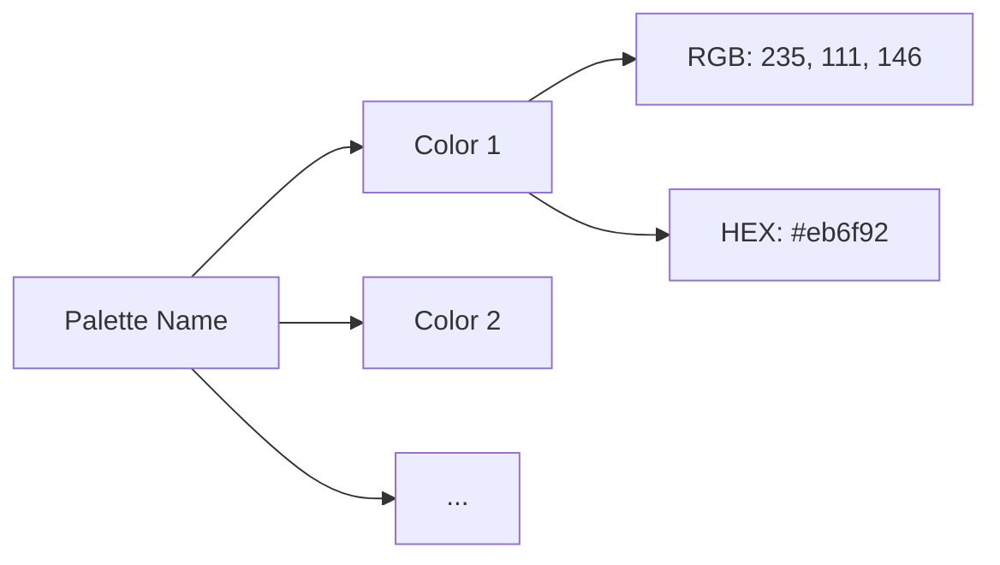

# 🗄️ Data and Schema

This document defines how **Colorful Folders** stores and resolves its state. All persistent data lives in the plugin's `data.json` file.

---

## 1. `ColorfulFoldersSettings` (Global Config)

Representing the entire `data.json` structure. Defined in `src/common/types.ts`.

| Key | Type | Description |
| :--- | :--- | :--- |
| **Visual Palette** | | |
| `palette` | `string` | Active palette name (e.g., "Neon Cyberpunk"). |
| `customPalette` | `string` | Comma-separated hex list for the "Custom" palette mode. |
| `colorMode` | `string` | `cycle` (sequential), `monochromatic` (fixed root color), or `heatmap` (by age). |
| `cycleOffset` | `number` | Shifts the starting point of the color cycle. |
| **Opacity & Accents** | | |
| `rootOpacity` | `number` | Background transparency of top-level folders (0-1). |
| `subfolderOpacity` | `number` | Background transparency of nested folders (0-1). |
| `tintOpacity` | `number` | Global transparency for folder background colors. |
| `rootTintOpacity` | `number` | Specific tint transparency for root folders. |
| `fileBackgroundOpacity` | `number` | Transparency for file background highlights. |
| `globalBackgroundColor` | `string` | Forces a specific hex/color across all items if set. |
| **Radiant Path & Active Highlighting** | | |
| `activeGlow` | `boolean` | Applies a luminous box-shadow and gradient sheen to the active item. |
| `pathLineThickness` | `number` | Dynamic stroke width for Radiant Path indentation lines and active highlights. |
| `useCustomActiveColor` | `boolean` | Enables the UI-driven active file color picker. |
| `customActiveBg` | `string` | User-defined background for the active file. |
| `customActiveText` | `string` | User-defined text color for the active file. |
| **Auto-Icons & Scaling** | | |
| `autoIcons` | `boolean` | Automatically assigns icons based on folder/file names. |
| `autoIconVariety` | `boolean` | Assigns different icons to items within the same category. |
| `wideAutoIcons` | `boolean` | Prefers Lucide icons over emojis for automatic assignment. |
| `customIconRules` | `string` | Simple pattern match string (e.g., `Work = briefcase @200`). |
| `iconScale` | `number` | Multiplier for all folder/file icons. |
| **Typography & Structure** | | |
| `rootStyle` | `string` | `translucent` or `solid` design for root folders. |
| `rainbowRootText` | `boolean` | Applies horizontal rainbow gradients to root folder text. |
| `rainbowRootBgTransparent`| `boolean` | Removes root background box when rainbow text is active. |
| `showItemCounters` | `boolean` | Displays recursive item counts next to folders. |
| `autoColorFiles` | `boolean` | Automatically assigns colors to files based on parent or name. |
| **Section Dividers** | | |
| `dividerThickness` | `number` | Stroke width for section divider lines. |
| `dividerSpacing` | `number` | Vertical padding above/below dividers. |
| `dividerLineStyle` | `string` | `solid`, `dashed`, or `dotted`. |
| `dividerLinePaddingLeft` | `number` | Gap between line and text (Left). |
| `dividerLinePaddingRight` | `number` | Gap between line and text (Right). |
| `dividerPillMode` | `boolean` | Enables/Disables the "Modern Pill" design wrapper. |
| `dividerPillColor` | `string` | Universal background color for all divider pills. |
| **Integrations** | | |
| `notebookNavigatorSupport` | `boolean` | Enables styling for Notebook Navigator items. |
| `notebookNavigatorFileBackground` | `boolean` | Applies background colors to NN file items. |
| `notebookNavigatorOutlineOnly` | `boolean` | Force outline-only mode specifically for NN items. |
| **System & Privacy** | | |
| `showHiddenItems` | `boolean` | Toggles "Stealth Mode" visibility. |
| `showRibbonIcon` | `boolean` | Displays the Stealth Mode eye icon in the sidebar. |
| `vaultPassword` | `string` | Hashed password for privacy lock. |
| `isVaultLocked` | `boolean` | Session state of the password lock. |
| `lastVersion` | `string` | Tracks the last version to show the changelog on update. |

---

## 2. `FolderStyle` (Local Override)

Stored inside `customFolderColors` for specific paths.

> [!TIP]
> Items marked with `applyToSubfolders: true` will cascade their visual style down the entire directory tree.

```typescript
interface FolderStyle {
    hex?: string;                    // Background color (hex)
    textColor?: string;              // Label color override (hex)
    iconColor?: string;              // Custom icon color override (hex)
    iconId?: string;                 // Custom icon ID (Lucide, emoji, or Custom)
    opacity?: number;                // Background transparency (0-1)
    isBold?: boolean;                // Label bold font-weight override
    isItalic?: boolean;              // Label italic style override
    applyToSubfolders?: boolean;     // Cascade style to nested subfolders
    applyToFiles?: boolean;          // Cascade style to nested files
    hasDivider?: boolean;            // Displays a section divider before this item
    dividerText?: string;            // Text label inside the divider pill
    dividerColor?: string;           // Custom color for the divider line/pill
    dividerAlignment?: string;       // Alignment of the divider text ('left', 'center', 'right')
    dividerLineStyle?: string;       // Line pattern ('solid', 'dashed', 'dotted', 'double')
    dividerIcon?: string;            // Custom Lucide/emoji divider icon ID
    dividerIconColor?: string;       // Custom color override for the divider icon
    dividerUpper?: boolean;          // Force uppercase on the divider label text
    dividerGlass?: boolean;          // Glassmorphic backdrop filter on the divider
    dividerIconPosition?: 'left' | 'right' | 'both'; // Placement of the divider icon
    dividerPillMode?: 'global' | 'on' | 'off';     // Interactive Pill Mode override
    dividerDescription?: string;     // Premium Markdown hover popover content
    dividerPillColor?: string;       // Background color override for the divider pill
    dividerLinePaddingLeft?: number; // Asymmetrical padding between line and text (Left)
    dividerLinePaddingRight?: number;// Asymmetrical padding between line and text (Right)
    isHidden?: boolean;              // Stealth Mode privacy hide toggle
}
```

---

## 3. The Palette System

Palettes are defined in `src/common/constants.ts` under `PALETTES`. 



---

## 4. Automation Rules (Auto-Icons)

Auto-icons use a priority-based regex matching system in `AUTO_ICON_CATEGORIES`.

> [!IMPORTANT]
> **Priority Scoring**:
> 1. The plugin takes the folder/file name.
> 2. It iterates through `AUTO_ICON_CATEGORIES`.
> 3. The **first** regex that matches the name "wins".

---

## 5. Persistence Strategy

- **Saving**: `this.saveData(this.settings)`. Wrapped in `plugin.saveSettings()` to trigger UI refreshes.
- **Loading**: `Object.assign({}, DEFAULT_SETTINGS, await this.loadData())` ensures schema compatibility.
- **Debouncing**: Settings changes are debounced to prevent disk I/O bottlenecks.

---

> [!CAUTION]
> Never modify `data.json` manually while Obsidian is running, as the plugin keeps a copy in memory and will overwrite your changes upon the next save.
---

## 6. Backup & Restore Schema

When exporting data via the "Database management" tools, the generated JSON files follow a standardized wrapper format.

### Folder Style Backup (`cf-folder-backup`)
```json
{
  "type": "cf-folder-backup",
  "version": "1.0",
  "data": {
    "Work/Project-A": {
      "hex": "#ff0000",
      "iconId": "lucide-star"
    }
  },
  "presets": { ... }
}
```

### Divider Backup (`cf-divider-backup`)
```json
{
  "type": "cf-divider-backup",
  "version": "1.0",
  "data": {
    "Resources": {
      "hasDivider": true,
      "dividerText": "Library",
      "dividerColor": "#00ff00"
    }
  }
}
```

> [!NOTE]
> During restore, the plugin validates the `type` field to ensure the data is merged into the correct properties of the `customFolderColors` record.
