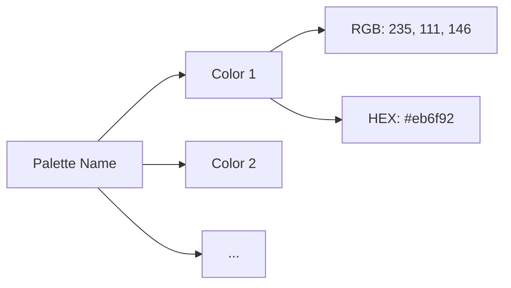

# 🗄️ Data and Schema

This document defines how **Colorful Folders** stores and resolves its state. All persistent data lives in the plugin's `data.json` file.

---

## 1. `ColorfulFoldersSettings` (Global Config)

Representing the entire `data.json` structure. Defined in `src/common/types.ts`.

| Key | Type | Description |
| :--- | :--- | :--- |
| `palette` | `string` | Active palette name (e.g., "Neon Cyberpunk"). |
| `colorMode` | `string` | `cycle`, `monochromatic`, or `heatmap`. |
| `customFolderColors` | `Record` | Key = Path. Value = Style overrides. |
| `customIcons` | `Record` | Key = Icon ID. Value = Raw SVG string. |
| `glassmorphism` | `boolean` | Enables backdrop-blur effects. |
| `activeGlow` | `boolean` | Applies a luminous box-shadow and gradient sheen to the active item. |
| `vaultPassword` | `string` | Hashed password for Stealth Mode. |
| `isVaultLocked` | `boolean` | Session-based state of the privacy lock. |
| `dividerThickness` | `number` | Stroke width for divider lines. |
| `dividerLinePaddingLeft` | `number` | Gap between line and text (Left). Supports negative values. |
| `dividerLinePaddingRight` | `number` | Gap between line and text (Right). Supports negative values. |

---

## 2. `FolderStyle` (Local Override)

Stored inside `customFolderColors` for specific paths.

> [!TIP]
> Items marked with `applyToSubfolders: true` will cascade their visual style down the entire directory tree.

```typescript
interface FolderStyle {
    hex?: string;                 // Background color (hex)
    textColor?: string;           // Label color override
    iconId?: string;              // Custom icon (Lucide or Custom ID)
    opacity?: number;             // Background transparency (0-1)
    isBold?: boolean;             // Label font-weight override
    applyToSubfolders?: boolean;  // Inheritance toggle for children
    hasDivider?: boolean;           // Section divider presence
    dividerText?: string;           // Divider chip label
    dividerDescription?: string;    // Markdown hover content
    dividerLineStyle?: string;      // solid, dashed, dotted, double
    dividerLinePaddingLeft?: number; // Asymmetrical gap
    isHidden?: boolean;             // Stealth Mode visibility toggle
}
```

---

## 3. The Palette System

Palettes are defined in `src/common/constants.ts` under `PALETTES`. 



---

## 4. Automation Rules (Auto-Icons)

Auto-icons use a priority-based regex matching system in `AUTO_ICON_CATEGORIES`.

> [!IMPORTANT]
> **Priority Scoring**:
> 1. The plugin takes the folder/file name.
> 2. It iterates through `AUTO_ICON_CATEGORIES`.
> 3. The **first** regex that matches the name "wins".

---

## 5. Persistence Strategy

- **Saving**: `this.saveData(this.settings)`. Wrapped in `plugin.saveSettings()` to trigger UI refreshes.
- **Loading**: `Object.assign({}, DEFAULT_SETTINGS, await this.loadData())` ensures schema compatibility.
- **Debouncing**: Settings changes are debounced to prevent disk I/O bottlenecks.

---

> [!CAUTION]
> Never modify `data.json` manually while Obsidian is running, as the plugin keeps a copy in memory and will overwrite your changes upon the next save.
