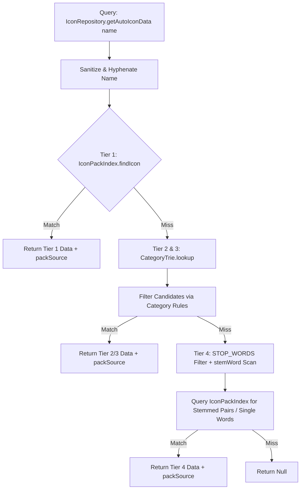

# ⚙️ Engine Internals: Low-Level Logic

> [!NOTE]
> This document details the low-level internals of **Colorful Folders** under the Zero-DOM / `document.adoptedStyleSheets` architecture and the Tiered Icon Selection Engine.

---

## 1. Global Event Lifecycle

Colorful Folders hooks into the Obsidian event bus and DOM observers reactively:

| Event | Handler | Rationale |
| :--- | :--- | :--- |
| `layout-change` | `DOMObserverService` | Re-attaches window document stylesheets and tags newly rendered explorer containers (`data-cf-path`). |
| `css-change` | `EventTrackerService` | Theme switches (Light/Dark) trigger debounced contrast recalculations. |
| `file-open` | `EventTrackerService` | Updates active folder path markers dynamically (`.is-active-path`). |
| `dragstart` | `EventTrackerService` | Sets `plugin.isDragging = true` and suspends all styling and observer work during drag. |
| `dragend` | `EventTrackerService` | Resets `isDragging` and runs a catch-up render. |
| `create` / `delete` / `rename` | `EventTrackerService` | Vault structure changes; invalidates item count, heatmap, and icon caches. |
| `scroll` (container) | `DOMObserverService` | Suspends observer calculations during active scroll, queuing a single debounced catch-up sync after scroll stops. |
| `layout-ready` | `main.ts` | Triggers startup cache pre-warming via `requestIdleCallback()` for core folder and document icons. |
| `generateStyles` (post-render) | `main.ts / GraphColorSync` | Syncs folder colors to `.obsidian/graph.json` color groups if `graphColorSync` is enabled. |

---

## 2. Low-Level Flat Selector Map

The Zero-DOM engine uses flat attribute selectors to target file explorer items directly:

### 📂 Folder Elements
- `.nav-folder-title[data-cf-path="..."]`: Target folder title bar.
- `.nav-folder-title[data-cf-path="..."] .nav-folder-title-content::before`: Icon rendered via SVG Data URI mask or Emoji.
- `.nav-folder-title[data-cf-path="..."] ~ .nav-folder-children`: Container tint for nested items.

### 📄 File Elements
- `.nav-file-title[data-cf-path="..."]`: File title bar.
- `.nav-file-title[data-cf-path="..."] .nav-file-title-content::before`: File icon rendered via SVG Data URI mask.

### 📏 Section Dividers
- `.cf-has-divider[data-cf-divider="true"]::before`: Section divider bridge line and pill label.

---

## 3. Tiered Icon Selection Engine Internals

`IconRepository` processes icon resolution across 4 strict tiers using optimized internal data structures:

### 3.1 `IconPackIndex` (`src/core/IconPackIndex.ts`)
- Maintains `exactMap` and `suffixMap` to enable $O(1)$ icon lookups.
- Builds once per session with version-snapshot checking (`_localVersion`, `_customVersion`).
- Resolves suffix collisions at build time using `PACK_PRIORITY` weights:
  `custom` (100) > `lucide` (90) > `tabler` (80) > `simple-icons` (70) > `remix` (60) > `feather` (50) > `font-awesome` (40) > `material` (30).

### 3.2 `CategoryTrie` (`src/core/CategoryTrie.ts`)
- Indexes `AUTO_ICON_CATEGORIES` by initial character tokens of regex source strings.
- `lookup(name)` collects initial characters for **all words** in a title to aggregate candidate category rules, reducing evaluated patterns from 80+ to $\le 5$ per query.

### 3.3 Stemming & Stop-Word Engine (`STOP_WORDS` / `stemWord`)
- `STOP_WORDS` filters out question words (`how`, `why`, `where`), auxiliary verbs (`is`, `are`, `works`), and structural nouns (`folder`, `file`).
- `stemWord()` strips common English suffixes (`-ing`, `-ed`, `-es`, `-s`) before pack queries.
- Single-word scanning iterates from right to left (last to first) to prioritize primary subject nouns over leading filler words.

### 3.4 $O(1)$ LRU Cache Engine (`src/common/LRUCache.ts`)
- All string and Data-URI transformations are bounded by `LRUCache(2048)` instances (`_normCache`, `_dataUriCache`, `_findPackIconCache`).
- Uses `Map` delete-and-set key reordering for $O(1)$ amortized get/set/eviction operations.
- `preNormalizeIcon()` eagerly populates raw (`0:`) and encoded (`1:`) Data-URIs into `iconCache` on icon load, bypassing `DOMParser` stalls during rendering.

---

## 4. Performance & Caching Engine

### Debounced Architecture

- **`generateStylesDebounced` (100ms)**: Coalesces rapid style updates into a single `generateStyles()` execution.
- **`saveDataDebounced` (1000ms)**: Debounces settings disk writes.

---

## 5. AdoptedStyleSheet Lifecycle & Zero-DOM Storage

- Programmatic `CSSStyleSheet` instance owned by `AdoptedStyleSheetService`.
- Attached to `activeDocument.adoptedStyleSheets` and all popout window documents.
- `sheet.replaceSync(cssString)` executes in < 0.1ms without creating HTML `<style>` elements or modifying DOM child nodes.
