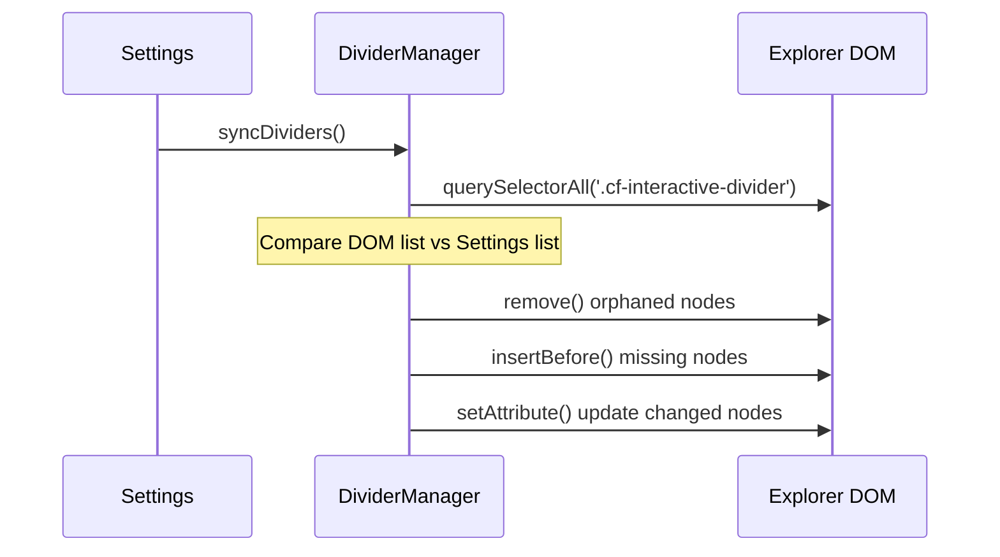

# ⚙️ Engine Internals: Low-Level Logic

This document explores the "Bare Metal" of the Colorful Folders plugin. It is intended for developers who need to optimize the core loops or debug the most elusive visual glitches.

## 1. The Global Event Lifecycle

Colorful Folders hooks into the Obsidian event bus to stay reactive.

| Event | Handler | Rationale |
| :--- | :--- | :--- |
| `layout-change` | `generateStyles` | Moving tabs or resizing panes can require style recalculations. |
| `css-change` | `generateStyles` | Theme changes (Light/Dark) invalidate our contrast calculations. |
| `file-open` | `generateStyles` | If "Active Path Glow" is enabled, we need to highlight the new path. |
| `modify` | `generateStyles` | (Only in Heatmap mode) File edits update the "Hot" status of folders. |
| `create` / `delete` / `rename` | `generateStyles` | Vault structure changes require a new traversal. |

---

## 2. Low-Level CSS Selector Map

The plugin generates a complex hierarchy of selectors. Understanding this map is critical for integration support.

### Folder Elements
*   `.nav-folder-title[data-path="..."]`: The clickable bar.
*   `.nav-folder-title[data-path="..."] .nav-folder-title-content`: The text label.
*   `.nav-folder-title[data-path="..."] .nav-folder-collapse-indicator`: The chevron.
*   `.nav-folder-title[data-path="..."] + .nav-folder-children`: The container for nested items.

### File Elements
*   `.nav-file-title[data-path="..."]`: The file card.
*   `.nav-file-title[data-path="..."] .nav-file-title-content`: The file name.

### Active Path Markers
*   `.nav-folder-title.is-active-path`: Applied to all ancestors of the current file.
*   `.nav-file-title.is-active`: Applied to the current file.

---

## 3. Contrast & Accessibility Logic

We automatically ensure that text is readable against the background.

**Algorithm (`utils.ts`)**:
1.  Take the background color (`hex`).
2.  Calculate its **Relative Luminance** (Y).
3.  If `Y < 0.5` (Dark background), we use a lightened version of the palette color for the text.
4.  If `Y > 0.5` (Light background), we use a darkened version.

This ensures that even if a user picks a very dark "Neon" color, the text remains crisp and legible.

---

## 4. Performance Optimization: The "High-Speed Assembly"
To handle vaults with 20,000+ files, we use a tiered optimization strategy:

1.  **Array-Based CSS Assembly**: Instead of standard string concatenation (`css += ...`), which becomes exponentially slow in large loops, `StyleGenerator.ts` uses an array-based string builder (`cssRules: string[]`). All rules are pushed into the array and joined once via `cssRules.join('\n')` at the end of the traversal.
2.  **UI Event Debouncer**: (50ms) Aggregates rapid events (like typing or folder expansion).
3.  **Style Generation Lock**: A boolean flag (`isGenerating`) prevents multiple traversals from running concurrently.
4.  **Recursive Pruning**: The `traverse` function skips folders listed in the `exclusionList` immediately, preventing unnecessary `getEffectiveStyle` calls for massive `.git` or `node_modules` folders.

---

## 5. Virtual DOM Reconciliation (Dividers)

The `DividerManager` uses a **Shadow State** to track what is currently in the DOM.



---

## 6. How to Debug a Style Conflict

If a folder isn't coloring correctly:
1.  Enable **"Icon debug mode"**.
2.  Check the console for `[Colorful Folders] Rendering path: ...`.
3.  Inspect the element in DevTools.
4.  Check if a more specific CSS rule from your theme is overriding ours (e.g., `#specific-id .nav-folder-title`).
5.  Check the `z-index` of the `.nav-folder-children` tint; sometimes themes place it behind the explorer background.

---

## 7. HSV Color Picker Synchronization

The color picker uses a standardized range system to ensure perfect alignment between the UI board and the resulting CSS.

**Standard Ranges**:
*   **Hue**: 0-360 degrees (Mapped directly to CSS `hsl()` for board background).
*   **Saturation**: 0-100 (Mapped to horizontal `X` coordinate).
*   **Value (Brightness)**: 0-100 (Mapped to vertical `Y` coordinate).

When a Hex code is pasted, the `syncFromHex` function converts it to these integer ranges, allowing the UI thumb to snap to the exact pixel coordinate without rounding drift.

---

## 8. SVG Normalization & DOM Sanitization

To ensure icons are theme-resilient and secure, the `IconManager.normalizeSvg` process performs the following:

1.  **DOM-Based Sanitization**: Instead of fragile regex cleaning, we use a recursive DOM traversal to strip forbidden tags (`script`, `iframe`, `foreignObject`) and remove all `on-` event handlers and `javascript:` URIs.
2.  **Background Removal**: Identifies elements (rects/paths) that cover >90% of the viewport and removes them to prevent "opaque boxes" behind icons.
3.  **Attribute Hardening**: Detects if an icon is stroke-based (Feather/Lucide) or fill-based (Remix/FA) and injects the appropriate `fill: currentColor` or `stroke: currentColor` attributes via the DOM API.
4.  **Path Preservation**: Unlike standard cleaners, we preserve white/black paths and complex `<defs>` (gradients) within the icon tree to maintain the "soul" of professional icon sets.
5.  **Minification**: Serializes the sanitized DOM and strips redundant whitespace to minimize the final injected CSS string size.

---

## 9. Folder & File Item Counters

The plugin dynamically calculates the item counts for every folder in the vault during the rendering cycle.

*   **Performance**: Uses a `countCache` (Map) to prevent redundant vault traversals for nested subfolders.
*   **Visual Style**: Generates a custom dual-indicator SVG containing both Folder and File counts. 
*   **Readability**: These indicators use a high-visibility bold weight (**900**) and are right-aligned to the explorer item using CSS `::after` pseudo-elements.

---

## 9. Stealth Mode (Data Hider) Logic

The Stealth Mode is a CSS-driven privacy layer.

**The Workflow**:
1.  **State Activation**: When the vault is "Locked", the plugin adds `.cf-stealth-active` to the `document.body`.
2.  **CSS Filter**: A global CSS rule is injected:
    ```css
    .cf-stealth-active .nav-folder-title[data-path*="sensitive"],
    .cf-stealth-active .nav-file-title[data-path*="sensitive"] {
        display: none !important;
    }
    ```
3.  **Dynamic Updates**: When the user enters the correct password, the class is removed, and `generateStyles()` is called to refresh the UI instantly.
4.  **Ribbon Toggle**: The ribbon icon changes visually (Lock/Unlock) to indicate the current privacy state.
