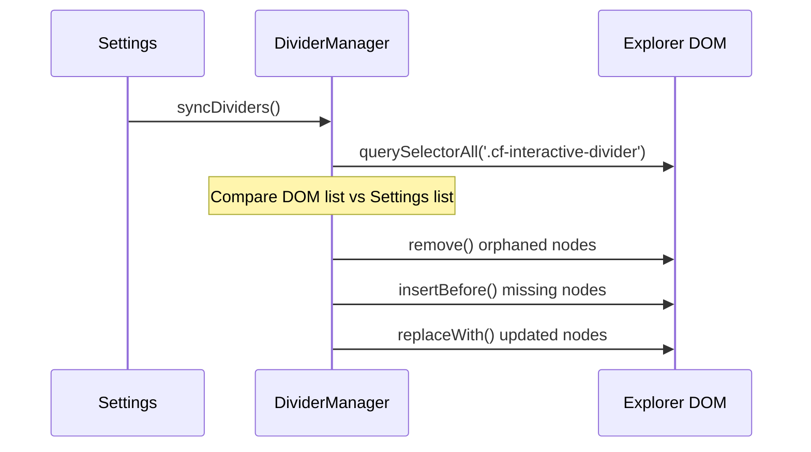

# ⚙️ Engine Internals: Low-Level Logic

> [!NOTE]
> This document explores the "Bare Metal" of the **Colorful Folders** plugin. It is intended for developers who need to optimize core loops or debug elusive visual glitches.

---

## 1. Global Event Lifecycle

Colorful Folders hooks into the Obsidian event bus to stay reactive.

| Event | Handler | Rationale |
| :--- | :--- | :--- |
| `layout-change` | `DOMObserverService` | UI recalculation on pane resizing/moving; re-attaches DOM observers. |
| `css-change` | `EventTrackerService` | Theme changes (Light/Dark) invalidate contrast calculations. |
| `file-open` | `EventTrackerService` | Updates the active parent/ancestor folder classes (`.cf-active-parent`) dynamically for active folder path highlighting, bypassing CSS generation. |
| `dragstart` | `EventTrackerService` | **Performance**: Sets `plugin.isDragging = true` and suspends all styling logic during drag. |
| `dragend` | `EventTrackerService` | **Performance**: Restores observers and performs a clean 'catch-up' sync. |
| `create` / `delete` / `rename` | `EventTrackerService` | Vault structure changes; invalidates item count and heatmap caches. |
| `scroll` (container) | `DOMObserverService` | Repositions interactive dividers and suppresses heavy DOM injections (like icons) mid-scroll. Queues a single catch-up render via `refreshIconsDebounced` after scrolling stops. Unbound on plugin disable. |
| `generateStyles` (post-render) | `main.ts / GraphColorSync` | **Graph View**: After CSS injection, syncs folder hex colors to `.obsidian/graph.json` colorGroups if `graphColorSync` is enabled. Runs async to avoid blocking the render cycle. |

### Service Architecture
To maintain a strict separation of concerns, global event lifecycles are explicitly managed by the **`EventTrackerService`** and the **`DOMObserverService`**. `main.ts` acts merely as the central orchestrator orchestrating these specialized classes, ensuring all observers and events are cleanly detached on unload to prevent memory leaks.


---

## 2. Low-Level CSS Selector Map

The plugin generates a complex hierarchy of selectors. Understanding this map is critical for integration support.

### 📂 Folder Elements
*   `.nav-folder-title[data-path="..."]`: The clickable bar.
*   `.nav-folder-title-content`: The text label.
*   `.nav-folder-collapse-indicator`: The chevron.
*   `+ .nav-folder-children`: The container for nested items.

### 📄 File Elements
*   `.nav-file-title[data-path="..."]`: The file card.
*   `.nav-file-title-content`: The file name.

### ✨ Active Path Markers
*   `.nav-folder-title.is-active-path`: Ancestors of the current file.
*   `.nav-file-title.is-active`: The currently open file.

---

## 3. Contrast and Accessibility Logic

We automatically ensure that text is readable against the background.

> [!TIP]
> **The Algorithm (`utils.ts`)**:
> 1. Calculate the **Relative Luminance** (Y) of the background.
> 2. If `Y < 0.5` (Dark background), we use a lightened version of the palette color.
> 3. If `Y > 0.5` (Light background), we use a darkened version.

This ensures that even if a user picks extreme colors, the text remains crisp and legible.

---

## 4. Performance & Caching Engine

### Debounced Architecture

All expensive operations are protected by three independent `Debouncer` instances on the plugin class. They ensure that rapid successive events (e.g. theme switches, folder renames, scroll stops) are coalesced into a single operation and that heavy work is suspended entirely during drag-and-drop.

| Debouncer | Delay | Edge | Guard condition | What it calls |
|:---|:---:|:---:|:---|:---|
| `generateStylesDebounced` | **100ms** | Leading | `isDragging` | `generateStyles()` — full CSS rebuild |
| `processDividersDebounced` | **50ms** | Leading | `isSyncingDividers`, `isDragging` | `dividerManager.syncDividers()` |
| `refreshIconsDebounced` | **100ms** | Leading | `isDragging` | `refreshIcons()` — icon DOM injection |

> [!NOTE]
> All three debouncers use **leading-edge** execution (Obsidian's `debounce(..., true)`) so the very first event in a burst triggers immediately, then subsequent events within the window are ignored. This provides instant visual feedback without redundant renders.

**Drag-and-Drop Suspension:**
When `dragstart` fires, `plugin.isDragging = true`. All three debouncers check this flag and return early, completely suspending CSS generation, divider DOM updates, and icon injection. On `dragend`, `isDragging` is reset and a single catch-up render runs.

---

### Startup Optimizations

| Optimization | Location | Description |
| :--- | :--- | :--- |
| **Parallel SVG Loading** | `main.ts → loadLocalIcons()` | Local icons in `.obsidian/icons` are read with `Promise.all()` instead of a serial loop. In vaults with 750+ SVGs this saves **200-400ms** of startup time. |
| **Shallow Settings Clone** | `main.ts → loadSettings()` | The default settings are merged with a direct `Object.assign` spread instead of `JSON.parse(JSON.stringify(...))`, which was wastefully deep-cloning the entire settings schema. |
| **Synchronous Style Init** | `main.ts → onLayoutReady()` | Styles are generated synchronously the instant the layout is ready — no artificial `setTimeout` delay. This eliminates the intermittent "flash of unstyled content" that occurred when the event loop was congested. |
| **Deferred Local Icon Load** | `main.ts → onLayoutReady()` | Local icon discovery is deferred by 2 seconds after layout ready to avoid competing with Obsidian's own startup I/O. |

### Runtime Optimizations

1.  **Tiered Caching Engine**:
    *   **Folder Count Cache**: A persistent `Map` on the plugin instance. Item counts are only re-calculated when the vault structure actually changes (`create`/`delete`/`rename`).
    *   **Icon Category Memoization**: Custom icon regex rules and category lookups are compiled once and cached. The cache is invalidated only when `customIconRules` or `customIcons` changes, not on every `saveSettings()` call.
    *   **SVG Normalization Cache**: The result of `DOMParser` sanitization is cached, ensuring constant SVGs (like folder icons) are only parsed once per session.
    *   **Counter SVG Template Cache**: In `StyleGenerator`, the three static SVG segments of the folder counter icon are pre-encoded with `encodeURIComponent()` once per unique color. Subsequent folders of the same color use O(1) string concatenation instead of re-running the expensive encode + regex chain.
    *   **Palette Cache**: `ColorResolver.getCurrentPalette()` (in `src/core/ColorResolver.ts`) is memoized by a key of `palette + customPalette + isDark`. Light-mode brightness adjustment is only recalculated when this key changes.
    *   **O(1) CSS Grouping (CssGrouper)**: Instead of string-hashing massive 500-character CSS blocks to group identical styles, the engine uses tiny, deterministic signature keys (e.g. `fileRow_#ff0000`). This completely eliminates hash computation bottlenecks in large vaults (10,000+ files), transforming O(N * string_length) lookup times into pure O(1).
    *   **Asynchronous Yielding (50ms Window)**: During tree traversal, `StyleGenerator` yields back to the browser's main thread every 50ms using a `setTimeout(0)`. This guarantees the UI remains interactive while calculating styles for massive vaults, but limits sleep frequency to ensure near-instantaneous load times.

2.  **Selective Icon Cache Invalidation** (`main.ts → saveSettings()`):
    Snapshot keys (`_lastIconRulesKey`, `_lastCustomIconsKey`) track the last saved values of icon-relevant settings. The SVG icon cache is **only cleared** when `customIcons` or `customIconRules` actually changes. Toggling unrelated settings (opacity, tag sync, glassmorphism, etc.) no longer evicts the entire cache.

3.  **Observer Decoupling & Filtering**:
    *   **Style Observer Filtering**: The `MutationObserver` on `activeDocument.body` strictly filters for critical theme changes (`theme-dark`, `theme-light`) and ignores noisy interaction classes (`is-dragging`, `is-focused`, `workspace-leaf-active`). This prevents layout thrashing during user navigation.
    *   **Divider & Icon Observer Filtering**: The explorer `MutationObserver` skips updates if the user `isScrolling`, ignores non-folder/file node types, and uses `addedNodes` to directly target changed nodes (O(1-5)) rather than re-scanning the entire container (O(N)).
    *   **`css-change` Debouncing**: The `css-change` event (triggered by theme switches) uses the leading-edge `generateStylesDebounced()` instead of a direct call, coalescing Obsidian's 3-5 rapid-fire events into a single traversal.

4.  **RAF-Batched DOM Injection**: 
    The `IconManager` routes all synchronous DOM injections (`injectIcon`) through a `requestAnimationFrame` batching queue (`_queueInjection`). This eliminates layout thrashing caused by interleaved DOM reads and writes during bulk renders. It also employs a version-stamp early-exit mechanism (`dataset.cfIconId`) to make repeat render requests virtually cost-free.

5.  **Defensive Programming / Null Safety**: 
    UI loops in `DOMObserverService` and `main.ts` explicitly guard against missing or uninitialized nodes (`doc.body`, `containerEl`). This prevents unexpected crashes when interacting with transient Obsidian UI states, such as detached popout windows or heavily customized workspaces.

---

## 5. Virtual DOM Reconciliation (Dividers)

The `DividerManager` uses a **Shadow State** to track what is currently in the DOM.



---

## 6. Migration and Schema Hardening

The plugin implements a two-stage migration in `main.ts` to ensure backward compatibility:

1.  **Raw Data Migration**: Legacy fields (e.g., `dividerLinePadding`) are automatically split into asymmetrical fields (`Left`/`Right`).
2.  **Type Hardening**: Corrupted hex strings are detected during traversal and reset to theme-safe defaults.
3.  **Null-Safety Enforcement**: All parsing result mappings from `hexToRgbObj` are explicitly defended against `null` returns (caused by invalid user values or 3-digit shorthand parsing anomalies) before accessing color channels, resolving runtime TypeErrors.

---

### 🎯 Focus Mode 3.0 (Strict Spotlight)
Focus Mode 3.0 uses a 3-tier visibility system to create a high-contrast spotlight effect:
1. **Tier 1: The Target**: The active file and its immediate parent folder (100% opacity, Bold Weight, Pulse Glow).
2. **Tier 2: The Siblings**: Immediate neighbors of the active folder (Capped 70% opacity, no filters).
3. **Tier 3: The Background**: Everything else, including deep ancestors (Grandparents). Deeply dimmed via instantaneous `brightness()` and `opacity` filters.

---

## 7. Debugging Style Conflicts

If a folder isn't coloring correctly:
1.  Enable **"Icon debug mode"** in settings.
2.  Check the console for `[Colorful Folders] Rendering path: ...`.
3.  Inspect the element in DevTools.
4.  Verify if a more specific CSS rule from a theme is overriding ours (e.g., `#specific-id .nav-folder-title`).
5.  Check the `z-index` of the `.nav-folder-children` tint.

---

## 8. HSV Color Picker Synchronization

The color picker uses a standardized range system for perfect UI alignment.

- **Hue**: 0-360 degrees (Mapped directly to CSS `hsl()`).
- **Saturation**: 0-100 (Mapped to horizontal `X`).
- **Value (Brightness)**: 0-100 (Mapped to vertical `Y`).

> [!NOTE]
> When a hex code is pasted, `syncFromHex` converts it to these integer ranges, allowing the UI thumb to snap to the exact pixel coordinate without rounding drift.

---

## 9. SVG Normalization and Sanitization

`IconManager.normalizeSvg` ensures icons are theme-resilient and secure:

1.  **DOM-Based Sanitization**: Recursively strips forbidden tags (`script`, `iframe`) and event handlers.
2.  **Background Removal**: Removes elements covering >90% of the viewport.
3.  **Attribute Hardening**: Injects `fill: currentColor` or `stroke: currentColor` based on icon type.
4.  **Path Preservation**: Keeps complex `<defs>` (gradients) intact.
5.  **Minification**: Serializes the sanitized DOM and strips redundant whitespace.

---

## 10. Folder and File Item Counters

The plugin calculates item counts dynamically during the rendering cycle.

- **Performance**: Uses a **Persistent Count Cache** (`folderCountCache`) to prevent redundant vault traversals. The counting logic lives in `VaultUtils.countItems(folder, plugin)` (`src/common/VaultUtils.ts`) and the cache is hosted on the plugin instance, surviving multiple render cycles and significantly boosting performance in deep hierarchies.
- **Invalidation**: The cache is automatically cleared when the vault triggers a structural event (`create`, `delete`, or `rename`).
- **Visual Style**: Custom dual-indicator SVG: `Folders / Files`.
- **Readability**: Numbers use a bold weight (**900**) and are right-aligned via `::after`.

---

## 11. Stealth Mode (Data Hider) Logic

The stealth mode is a CSS-driven privacy layer.

**The Workflow**:
1.  **State Activation**: When the vault is "Locked", the plugin ensures the `cf-show-hidden` class is removed from the `document.body`.
2.  **CSS Filter**: Global CSS rules are injected to set `display: none !important` for paths marked `isHidden` when the show class is absent.
3.  **Ribbon Toggle**: The ribbon icon changes visually (Lock/Unlock) to indicate the current privacy state.
4.  **Dynamic Updates**: When the user enters the correct password, the `cf-show-hidden` class is added and the UI is refreshed.

---

## 12. Dynamic Changelog System

To avoid shipping large binary files, we fetch release notes directly from GitHub.

- **Mechanism**: `main.ts` fetches the collective, raw release notes markdown from GitHub (`version.md` on the `main` branch).
- **Caching**: Fetched once per session and stored in-memory.
- **UX**: Rendered via `ChangelogModal` with glassmorphism effects.

---

> [!IMPORTANT]
> If you implement new low-level logic, ensure it is added to the **Global Event Lifecycle** table in Section 1.

---

## 13. Backup & Restore Logic

The backup system uses a **Selective Extraction Engine** to maintain data integrity between disparate styling layers.

### Data Extraction (Backup)
To prevent "property contamination," the engine filters the `customFolderColors` record during export:
- **Folders**: Uses a shallow-clone and `delete` loop to purge all keys matching the `divider*` pattern.
- **Dividers**: Uses a property-picking loop that only clones the 15 specific `divider` schema properties for entries where `hasDivider` is true.

### Merge Strategy (Restore)
The restore process uses a **Type-Aware Merging Algorithm**:
1.  **Parsing**: Reads the file via `FileReader` and casts to the `BackupData` interface.
2.  **Validation**: Checks the `type` property (`cf-folder-backup` vs `cf-divider-backup`).
3.  **Conflict Resolution**: 
    - If a folder already exists in the local settings, the plugin uses the **Object Spread operator** `{ ...existing, ...imported }`.
    - This allows for **Cumulative Configuration** (e.g., you can restore folder colors from Backup A and then restore dividers from Backup B without them overwriting each other).

### Popout Window Safety
To ensure full compatibility with Obsidian **Popout Windows**, the backup and restore system avoids global `document` or `activeDocument` in favor of `this.containerEl.ownerDocument`. 

1.  **Context Binding**: Temporary elements (`<a>` for downloads, `<input>` for uploads) are created using the `ownerDocument` of the settings tab container.
2.  **DOM Attachment**: Elements are explicitly appended to the `body` of that specific window before `.click()` is called, satisfying modern browser security policies for programmatic interaction.
---

## 14. DOM Observer Idempotency & RAF Queueing Engine

To maintain compatibility with third-party plugins that mutate the file explorer DOM (such as **Smart Connections** or **Notebook Navigator**), `DOMObserverService` and `IconManager` employ a **zero-mutation idempotency pattern**:

### 1. Version-Stamp Early Exit (`dataset.cfIconId` & `dataset.cfIconColor`)
Before creating or updating an icon wrapper (`.cf-icon-wrapper`), `IconManager._doInjectIcon()` inspects the existing wrapper's dataset attributes:
```typescript
const existingWrapper = el.querySelector<HTMLElement>('.cf-icon-wrapper');
if (existingWrapper &&
    existingWrapper.dataset.cfIconId === style.iconId &&
    existingWrapper.dataset.cfIconColor === color) {
    return; // Early exit in O(1) time - 0 DOM mutations!
}
```
If an external plugin causes a DOM mutation event on a tree item that already has its correct icon rendered, `IconManager` exits immediately. This prevents infinite mutation observer feedback loops.

### 2. RequestAnimationFrame (RAF) Queueing
Icon injection operations are not executed synchronously inside observer callbacks. Instead, calls are queued into `_pendingInjections` and processed in a single batch during the next animation frame:
```typescript
private _queueInjection(el: HTMLElement, style: FolderStyle) {
    this._pendingInjections.push({ el, style });
    if (!this._rafPending) {
        this._rafPending = true;
        window.requestAnimationFrame(() => {
            this._flushInjections();
            this._rafPending = false;
        });
    }
}
```

### 3. Target Node Filtering & Targeted Injections
- **Scope Guarding**: `DOMObserverService` ignores mutations targeting or contained within `.cf-icon-wrapper` or `.cf-interactive-divider`.
- **Node-Level Processing**: When items are added to the DOM during scrolling or virtual list recycling, `DOMObserverService` extracts newly added nodes from `MutationRecord.addedNodes` and calls `iconManager.injectIconsForNodes(nodelist)`, operating in $O(N_{\text{changed}})$ time rather than rescanning the full tree ($O(N_{\text{total}})$).

---

