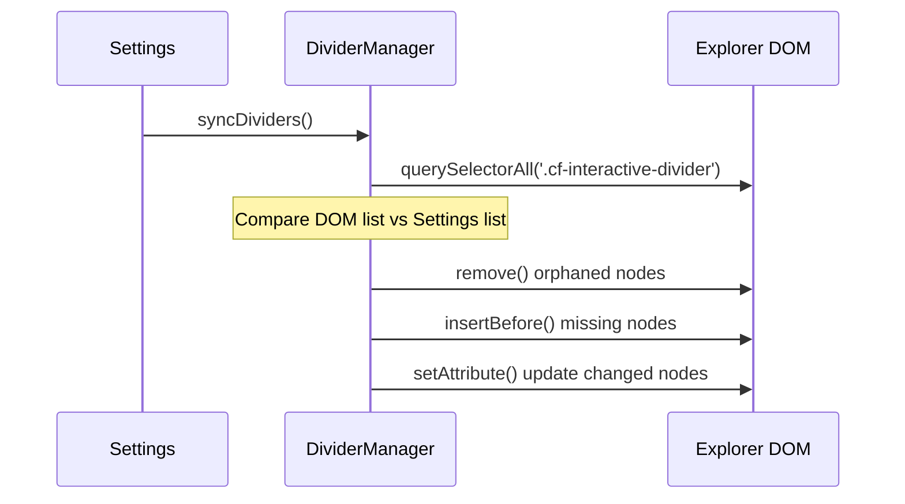

# ⚙️ Engine Internals: Low-Level Logic

This document explores the "Bare Metal" of the Colorful Folders plugin. It is intended for developers who need to optimize the core loops or debug the most elusive visual glitches.

## 1. The Global Event Lifecycle

Colorful Folders hooks into the Obsidian event bus to stay reactive.

| Event | Handler | Rationale |
| :--- | :--- | :--- |
| `layout-change` | `generateStyles` | Moving tabs or resizing panes can require style recalculations. |
| `css-change` | `generateStyles` | Theme changes (Light/Dark) invalidate our contrast calculations. |
| `file-open` | `generateStyles` | If "Active Path Glow" is enabled, we need to highlight the new path. |
| `modify` | `generateStyles` | (Only in Heatmap mode) File edits update the "Hot" status of folders. |
| `create` / `delete` / `rename` | `generateStyles` | Vault structure changes require a new traversal. |

---

## 2. Low-Level CSS Selector Map

The plugin generates a complex hierarchy of selectors. Understanding this map is critical for integration support.

### Folder Elements
*   `.nav-folder-title[data-path="..."]`: The clickable bar.
*   `.nav-folder-title[data-path="..."] .nav-folder-title-content`: The text label.
*   `.nav-folder-title[data-path="..."] .nav-folder-collapse-indicator`: The chevron.
*   `.nav-folder-title[data-path="..."] + .nav-folder-children`: The container for nested items.

### File Elements
*   `.nav-file-title[data-path="..."]`: The file card.
*   `.nav-file-title[data-path="..."] .nav-file-title-content`: The file name.

### Active Path Markers
*   `.nav-folder-title.is-active-path`: Applied to all ancestors of the current file.
*   `.nav-file-title.is-active`: Applied to the current file.

---

## 3. Contrast & Accessibility Logic

We automatically ensure that text is readable against the background.

**Algorithm (`utils.ts`)**:
1.  Take the background color (`hex`).
2.  Calculate its **Relative Luminance** (Y).
3.  If `Y < 0.5` (Dark background), we use a lightened version of the palette color for the text.
4.  If `Y > 0.5` (Light background), we use a darkened version.

This ensures that even if a user picks a very dark "Neon" color, the text remains crisp and legible.

---

## 4. Performance Optimization: The "Double Debounce"

To handle vaults with 20,000+ files, we use a tiered debouncing strategy:

1.  **UI Event Debouncer**: (50ms) Aggregates rapid events (like typing or folder expansion).
2.  **Style Generation Lock**: A boolean flag (`isGenerating`) prevents multiple traversals from running concurrently.
3.  **Recursive Pruning**: The `traverse` function skips folders listed in the `exclusionList` immediately, preventing unnecessary `getEffectiveStyle` calls for massive `.git` or `node_modules` folders.

---

## 5. Virtual DOM Reconciliation (Dividers)

The `DividerManager` uses a **Shadow State** to track what is currently in the DOM.

---

## 6. How to Debug a Style Conflict

If a folder isn't coloring correctly:
1.  Enable **"Icon debug mode"**.
2.  Check the console for `[Colorful Folders] Rendering path: ...`.
3.  Inspect the element in DevTools.
4.  Check if a more specific CSS rule from your theme is overriding ours (e.g., `#specific-id .nav-folder-title`).
5.  Check the `z-index` of the `.nav-folder-children` tint; sometimes themes place it behind the explorer background.
