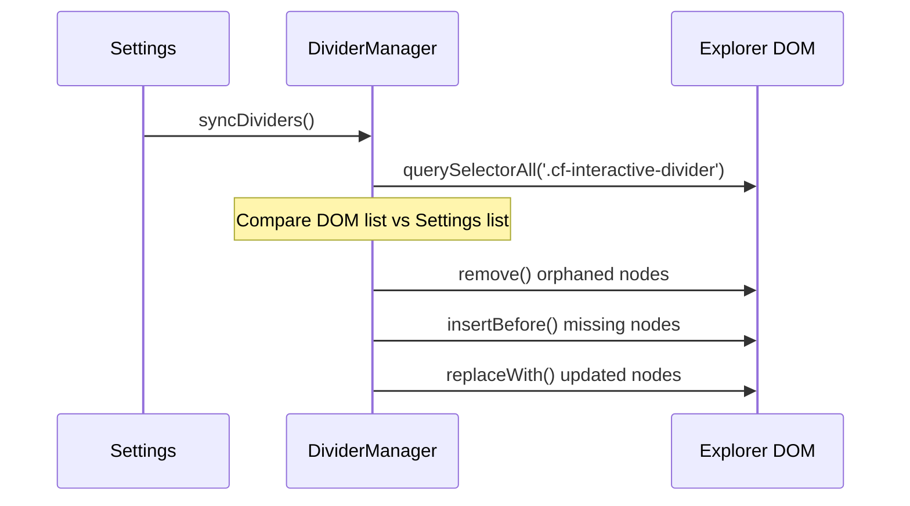

# ⚙️ Engine Internals: Low-Level Logic

> [!NOTE]
> This document explores the "Bare Metal" of the **Colorful Folders** plugin. It is intended for developers who need to optimize core loops or debug elusive visual glitches.

---

## 1. Global Event Lifecycle

Colorful Folders hooks into the Obsidian event bus to stay reactive.

| Event | Handler | Rationale |
| :--- | :--- | :--- |
| `layout-change` | `generateStyles` | UI recalculation on pane resizing/moving. |
| `css-change` | `generateStyles` | Theme changes (Light/Dark) invalidate contrast calculations. |
| `file-open` | `generateStyles` | Highlights new path if "Active Path Glow" is enabled. |
| `modify` | `generateStyles` | Updates "Hot" status in Heatmap mode. |
| `create` / `delete` / `rename` | `generateStyles` | Vault structure changes require a new traversal. |

---

## 2. Low-Level CSS Selector Map

The plugin generates a complex hierarchy of selectors. Understanding this map is critical for integration support.

### 📂 Folder Elements
*   `.nav-folder-title[data-path="..."]`: The clickable bar.
*   `.nav-folder-title-content`: The text label.
*   `.nav-folder-collapse-indicator`: The chevron.
*   `+ .nav-folder-children`: The container for nested items.

### 📄 File Elements
*   `.nav-file-title[data-path="..."]`: The file card.
*   `.nav-file-title-content`: The file name.

### ✨ Active Path Markers
*   `.nav-folder-title.is-active-path`: Ancestors of the current file.
*   `.nav-file-title.is-active`: The currently open file.

---

## 3. Contrast and Accessibility Logic

We automatically ensure that text is readable against the background.

> [!TIP]
> **The Algorithm (`utils.ts`)**:
> 1. Calculate the **Relative Luminance** (Y) of the background.
> 2. If `Y < 0.5` (Dark background), we use a lightened version of the palette color.
> 3. If `Y > 0.5` (Light background), we use a darkened version.

This ensures that even if a user picks extreme colors, the text remains crisp and legible.

---

## 4. Performance Optimization: High-Speed Assembly

To handle vaults with **20,000+ files**, we use a tiered optimization strategy:

1.  **Array-Based Assembly**: Instead of `css += ...`, we use `cssRules: string[]` and `join('\n')` at the end to prevent O(N²) concatenation overhead.
2.  **UI Event Debouncer**: (50ms) Aggregates rapid events like typing or folder expansion.
3.  **Generation Lock**: A boolean flag (`isGenerating`) prevents multiple traversals from running concurrently.
4.  **Recursion Pruning**: Immediately skip folders in the `exclusionList` (e.g., `.git`, `node_modules`).

---

## 5. Virtual DOM Reconciliation (Dividers)

The `DividerManager` uses a **Shadow State** to track what is currently in the DOM.

---

## 6. Migration and Schema Hardening

The plugin implements a two-stage migration in `main.ts` to ensure backward compatibility:

1.  **Raw Data Migration**: Legacy fields (e.g., `dividerLinePadding`) are automatically split into asymmetrical fields (`Left`/`Right`).
2.  **Type Hardening**: Corrupted hex strings are detected during traversal and reset to theme-safe defaults.

---

## 7. Debugging Style Conflicts

If a folder isn't coloring correctly:
1.  Enable **"Icon debug mode"** in settings.
2.  Check the console for `[Colorful Folders] Rendering path: ...`.
3.  Inspect the element in DevTools.
4.  Verify if a more specific CSS rule from a theme is overriding ours (e.g., `#specific-id .nav-folder-title`).
5.  Check the `z-index` of the `.nav-folder-children` tint.

---

## 8. HSV Color Picker Synchronization

The color picker uses a standardized range system for perfect UI alignment.

- **Hue**: 0-360 degrees (Mapped directly to CSS `hsl()`).
- **Saturation**: 0-100 (Mapped to horizontal `X`).
- **Value (Brightness)**: 0-100 (Mapped to vertical `Y`).

> [!NOTE]
> When a hex code is pasted, `syncFromHex` converts it to these integer ranges, allowing the UI thumb to snap to the exact pixel coordinate without rounding drift.

---

## 9. SVG Normalization and Sanitization

`IconManager.normalizeSvg` ensures icons are theme-resilient and secure:

1.  **DOM-Based Sanitization**: Recursively strips forbidden tags (`script`, `iframe`) and event handlers.
2.  **Background Removal**: Removes elements covering >90% of the viewport.
3.  **Attribute Hardening**: Injects `fill: currentColor` or `stroke: currentColor` based on icon type.
4.  **Path Preservation**: Keeps complex `<defs>` (gradients) intact.
5.  **Minification**: Serializes the sanitized DOM and strips redundant whitespace.

---

## 10. Folder and File Item Counters

The plugin calculates item counts dynamically during the rendering cycle.

- **Performance**: Uses a `countCache` (Map) to prevent redundant vault traversals for nested subfolders.
- **Visual Style**: Custom dual-indicator SVG: `Folders / Files`.
- **Readability**: Numbers use a bold weight (**900**) and are right-aligned via `::after`.

---

## 11. Stealth Mode (Data Hider) Logic

The stealth mode is a CSS-driven privacy layer.

**The Workflow**:
1.  **State Activation**: When the vault is "Locked", the plugin adds `.cf-stealth-active` to the `document.body`.
2.  **CSS Filter**: A global CSS rule is injected to collapse unauthorized items.
3.  **Ribbon Toggle**: The ribbon icon changes visually (Lock/Unlock) to indicate the current privacy state.
4.  **Dynamic Updates**: When the user enters the correct password, the class is removed and the UI is refreshed.

---

## 12. Dynamic Changelog System

To avoid shipping large binary files, we fetch release notes directly from GitHub.

- **Mechanism**: `main.ts` hits the raw URL for the version's markdown (e.g., `Version/VERSION_4_1_3.md`).
- **Caching**: Fetched once per session and stored in-memory.
- **UX**: Rendered via `ChangelogModal` with glassmorphism effects.

---

> [!IMPORTANT]
> If you implement new low-level logic, ensure it is added to the **Global Event Lifecycle** table in Section 1.
