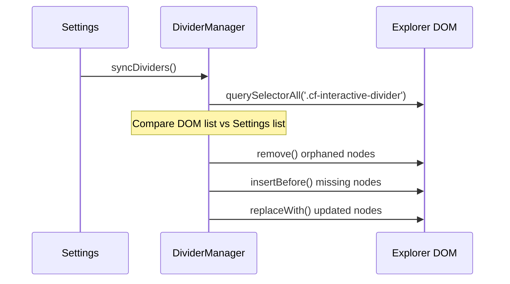

# ⚙️ Engine Internals: Low-Level Logic

> [!NOTE]
> This document explores the "Bare Metal" of the **Colorful Folders** plugin. It is intended for developers who need to optimize core loops or debug elusive visual glitches.

---

## 1. Global Event Lifecycle

Colorful Folders hooks into the Obsidian event bus to stay reactive.

| Event | Handler | Rationale |
| :--- | :--- | :--- |
| `layout-change` | `initDividerObserver` | UI recalculation on pane resizing/moving; re-attaches DOM observers. |
| `css-change` | `generateStyles` | Theme changes (Light/Dark) invalidate contrast calculations. |
| `file-open` | `generateStyles` | Highlights new path if "Active Path Glow" is enabled. |
| `modify` | `generateStyles` | Updates "Hot" status in Heatmap mode. |
| `create` / `delete` / `rename` | `generateStyles` | Vault structure changes; invalidates item count and heatmap caches. |

---

## 2. Low-Level CSS Selector Map

The plugin generates a complex hierarchy of selectors. Understanding this map is critical for integration support.

### 📂 Folder Elements
*   `.nav-folder-title[data-path="..."]`: The clickable bar.
*   `.nav-folder-title-content`: The text label.
*   `.nav-folder-collapse-indicator`: The chevron.
*   `+ .nav-folder-children`: The container for nested items.

### 📄 File Elements
*   `.nav-file-title[data-path="..."]`: The file card.
*   `.nav-file-title-content`: The file name.

### ✨ Active Path Markers
*   `.nav-folder-title.is-active-path`: Ancestors of the current file.
*   `.nav-file-title.is-active`: The currently open file.

---

## 3. Contrast and Accessibility Logic

We automatically ensure that text is readable against the background.

> [!TIP]
> **The Algorithm (`utils.ts`)**:
> 1. Calculate the **Relative Luminance** (Y) of the background.
> 2. If `Y < 0.5` (Dark background), we use a lightened version of the palette color.
> 3. If `Y > 0.5` (Light background), we use a darkened version.

This ensures that even if a user picks extreme colors, the text remains crisp and legible.

---

5.  **Tiered Caching Engine**:
    *   **Folder Count Cache**: A persistent `Map` on the plugin instance. Item counts are only re-calculated when the vault structure actually changes (`create`/`delete`/`rename`).
    *   **Icon Category Memoization**: Custom icon regex rules and category lookups are compiled once and cached.
    *   **SVG Normalization Cache**: The result of `DOMParser` sanitization is cached, ensuring constant SVGs (like folder icons) are only parsed once per session.
6.  **Observer Decoupling**: The `DividerManager`'s MutationObserver is decoupled from the main style render loop. It only re-initializes during structural `layout-change` events, preventing expensive DOM queries during every file navigation.

---

## 5. Virtual DOM Reconciliation (Dividers)

The `DividerManager` uses a **Shadow State** to track what is currently in the DOM.

---

## 6. Migration and Schema Hardening

The plugin implements a two-stage migration in `main.ts` to ensure backward compatibility:

1.  **Raw Data Migration**: Legacy fields (e.g., `dividerLinePadding`) are automatically split into asymmetrical fields (`Left`/`Right`).
2.  **Type Hardening**: Corrupted hex strings are detected during traversal and reset to theme-safe defaults.

---

## 7. Debugging Style Conflicts

If a folder isn't coloring correctly:
1.  Enable **"Icon debug mode"** in settings.
2.  Check the console for `[Colorful Folders] Rendering path: ...`.
3.  Inspect the element in DevTools.
4.  Verify if a more specific CSS rule from a theme is overriding ours (e.g., `#specific-id .nav-folder-title`).
5.  Check the `z-index` of the `.nav-folder-children` tint.

---

## 8. HSV Color Picker Synchronization

The color picker uses a standardized range system for perfect UI alignment.

- **Hue**: 0-360 degrees (Mapped directly to CSS `hsl()`).
- **Saturation**: 0-100 (Mapped to horizontal `X`).
- **Value (Brightness)**: 0-100 (Mapped to vertical `Y`).

> [!NOTE]
> When a hex code is pasted, `syncFromHex` converts it to these integer ranges, allowing the UI thumb to snap to the exact pixel coordinate without rounding drift.

---

## 9. SVG Normalization and Sanitization

`IconManager.normalizeSvg` ensures icons are theme-resilient and secure:

1.  **DOM-Based Sanitization**: Recursively strips forbidden tags (`script`, `iframe`) and event handlers.
2.  **Background Removal**: Removes elements covering >90% of the viewport.
3.  **Attribute Hardening**: Injects `fill: currentColor` or `stroke: currentColor` based on icon type.
4.  **Path Preservation**: Keeps complex `<defs>` (gradients) intact.
5.  **Minification**: Serializes the sanitized DOM and strips redundant whitespace.

---

## 10. Folder and File Item Counters

The plugin calculates item counts dynamically during the rendering cycle.

- **Performance**: Uses a **Persistent Count Cache** (`folderCountCache`) to prevent redundant vault traversals. This cache is hosted on the plugin instance and survives multiple render cycles, significantly boosting performance in deep hierarchies.
- **Invalidation**: The cache is automatically cleared when the vault triggers a structural event (`create`, `delete`, or `rename`).
- **Visual Style**: Custom dual-indicator SVG: `Folders / Files`.
- **Readability**: Numbers use a bold weight (**900**) and are right-aligned via `::after`.

---

## 11. Stealth Mode (Data Hider) Logic

The stealth mode is a CSS-driven privacy layer.

**The Workflow**:
1.  **State Activation**: When the vault is "Locked", the plugin ensures the `cf-show-hidden` class is removed from the `document.body`.
2.  **CSS Filter**: Global CSS rules are injected to set `display: none !important` for paths marked `isHidden` when the show class is absent.
3.  **Ribbon Toggle**: The ribbon icon changes visually (Lock/Unlock) to indicate the current privacy state.
4.  **Dynamic Updates**: When the user enters the correct password, the `cf-show-hidden` class is added and the UI is refreshed.

---

## 12. Dynamic Changelog System

To avoid shipping large binary files, we fetch release notes directly from GitHub.

- **Mechanism**: `main.ts` hits the raw URL for the version's markdown (e.g., `Version/VERSION_4_1_3.md`).
- **Caching**: Fetched once per session and stored in-memory.
- **UX**: Rendered via `ChangelogModal` with glassmorphism effects.

---

> [!IMPORTANT]
> If you implement new low-level logic, ensure it is added to the **Global Event Lifecycle** table in Section 1.
---

## 13. Backup & Restore Logic

The backup system uses a **Selective Extraction Engine** to maintain data integrity between disparate styling layers.

### Data Extraction (Backup)
To prevent "property contamination," the engine filters the `customFolderColors` record during export:
- **Folders**: Uses a shallow-clone and `delete` loop to purge all keys matching the `divider*` pattern.
- **Dividers**: Uses a property-picking loop that only clones the 15 specific `divider` schema properties for entries where `hasDivider` is true.

### Merge Strategy (Restore)
The restore process uses a **Type-Aware Merging Algorithm**:
1.  **Parsing**: Reads the file via `FileReader` and casts to the `BackupData` interface.
2.  **Validation**: Checks the `type` property (`cf-folder-backup` vs `cf-divider-backup`).
3.  **Conflict Resolution**: 
    - If a folder already exists in the local settings, the plugin uses the **Object Spread operator** `{ ...existing, ...imported }`.
    - This allows for **Cumulative Configuration** (e.g., you can restore folder colors from Backup A and then restore dividers from Backup B without them overwriting each other).

### Popout Window Safety
Standard `document.createElement('input')` is avoided in favor of `activeDocument.createEl('input')`. This ensures that if the plugin settings are open in an Obsidian **Popout Window**, the file selection dialog is correctly bound to the active window's context.

---

> [!IMPORTANT]
