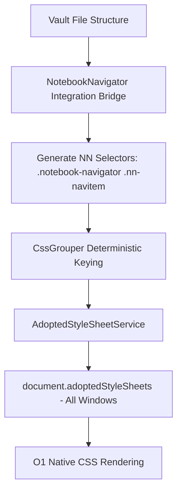

# 📓 Notebook Navigator Integration Guide (v5.0.0+ Zero-DOM Architecture)

This guide explains the technical architecture, challenges, and Zero-DOM solutions implemented to ensure **Colorful Folders** works seamlessly with the **Notebook Navigator** (NN) community plugin across all workspace windows.

---

## 1. The Core Challenge: Virtualized Lists

The primary challenge in styling Notebook Navigator is its use of a **Virtualized List** (React-based DOM recycling).

### The Problem:
In a virtualized list, the DOM elements (the rows in the sidebar and cards) are created, recycled, and destroyed constantly as you scroll.
- Using JavaScript to locate elements and set inline styles causes severe **Flickering** (rows appear white or default-colored for a split second before styling applies).
- High-speed scrolling starves JavaScript execution, leaving rows unstyled.
- Physical DOM element insertion (`
`, `<svg>`) triggers `childList` observer race conditions and layout thrashing in virtualized lists.

---

## 2. The Solution: Zero-DOM & Unified CSS Orchestration

To achieve zero-lag, 100% stable styling across native file explorer views and Notebook Navigator, **Colorful Folders v5.0.0+** uses a pure **Zero-DOM / `document.adoptedStyleSheets` Architecture**.

### How it works:
1. **Unified Selector handoff**: `NotebookNavigator.ts` evaluates the required color/icon for a path, constructs native Notebook Navigator selectors (e.g., `body .notebook-navigator .nn-navitem[data-path="Project A"]`), and hands them off to `CssGrouper`.
2. **Deterministic Grouping**: The core engine groups NN selectors alongside standard explorer selectors under a single, shared CSS block using a deterministic signature key (e.g., `fileRow_#eb6f92`).
3. **Constructable Stylesheet Adoption**: CSS is injected via `AdoptedStyleSheetService.ts` using `sheet.replaceSync()`, adopting directly onto `document.adoptedStyleSheets` across main and popout windows.

### Why this is superior:
- **O(1) Browser Native Rendering**: The browser's native CSS engine applies rules the exact nanosecond the row enters the viewport.
- **Zero DOM Injections**: No HTML elements are inserted into Notebook Navigator's virtualized list.
- **Immune to Virtualization**: As long as React renders `data-path="Project A"`, the browser applies styles instantaneously without JS intervention.

---

## 3. Surgical Icon Engine & Firewall

### A. Zero-DOM CSS Masking Strategy
Icons are rendered using CSS Data-URIs (`-webkit-mask-image: url("data:image/svg+xml;utf8,...")`) applied to `::before` pseudo-elements. This keeps icons perfectly positioned without DOM node injection.

### B. The CSS Firewall (Incident #9)
To prevent style leakage between standard explorer items and Notebook Navigator:
- All general explorer icon rules append `:not(.nn-file):not(.nn-navitem)`.
- Notebook Navigator relies exclusively on its dedicated integration selectors.

### C. Decoupled Icon Scaling
Notebook Navigator cards use a denser typography scale than the standard file explorer:
- **Standard Explorer**: Icons default to a **1.3em** base multiplier.
- **Notebook Navigator**: Icons default to a **1.1em** base multiplier, configurable via the independent **Navigator icon scaling** setting (defaults to `0.8`).

---

## 4. Stability & Performance

- **O(1) CSS Grouping**: Avoids string-hashing overhead by utilizing deterministic grouping keys.
- **Zero DOM Observers**: Dataset attribute updates do NOT fire `childList` mutation events, eliminating race conditions with third-party observers (*Smart Connections*).
- **Multi-Window Support**: Synchronizes stylesheets across popout windows automatically via `AdoptedStyleSheetService.ts` and `"window-open"` hooks.

---

## 5. Technical Selectors Reference

If writing custom CSS snippets for Notebook Navigator, use these high-specificity selectors:

| Element | Selector |
| :--- | :--- |
| **NN Folder Item** | `body .notebook-navigator .nn-navitem[data-path="..."]` |
| **NN File Item** | `body .notebook-navigator .nn-file[data-path="..."]` |
| **NN Item Name** | `.nn-navitem-name` / `.nn-file-name` |
| **NN Item Icon** | `.nn-navitem-icon` / `.nn-file-icon` |
| **Active / Selected** | `.is-active` / `.nn-selected` |

---

> [!TIP]
> **Performance First**: Avoid using heavy CSS filters (such as multi-layer `drop-shadow` or `blur`) on thousands of virtualized NN items. Standard `background-color`, `color`, and opacity rules yield the smoothest 60FPS scroll experience.
