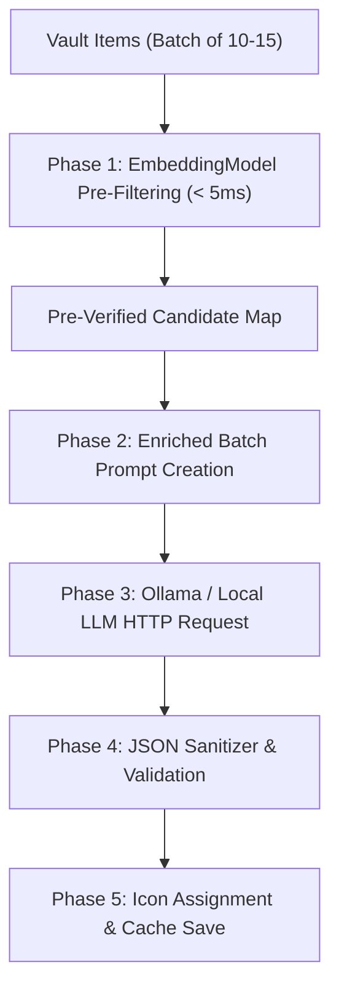

# 🚀 Comprehensive Strategic Plan & Critical Analysis: Batched Pre-Embedding Hybrid Pipeline

---

## 1. 🗺️ Implementation Roadmap

### **Architecture Overview**
The **Batched Pre-Embedding Hybrid Pipeline** bridges local vector math with LLM semantic reasoning. Before sending any HTTP request to the LLM, [embedingmodel.ts](file:///r:/Obsidian/Testsub1/.obsidian/plugins/colorful-folders/src/integrations/embedingmodel.ts) pre-calculates candidate icon vectors in **< 5ms**. [AIIconClassifier.ts](file:///r:/Obsidian/Testsub1/.obsidian/plugins/colorful-folders/src/integrations/AIIconClassifier.ts) then injects these pre-verified candidates into a single batched prompt for Ollama/Local LLM.



---

### **Milestones & Deliverables**

#### **Milestone 1: Vector Pre-Filtering Engine (`embedingmodel.ts`)**
- **Task**: Implement `getBatchVectorCandidates(items, topK = 5)` to extract candidate icon IDs for 10–15 items in < 5ms.
- **Deliverable**: High-speed synchronous mapping `{ [itemPath]: string[] }`.

#### **Milestone 2: Batched Hybrid Prompt Builder (`AIIconClassifier.ts`)**
- **Task**: Update `buildSystemPrompt()` and batch payload generation to include item paths, titles, parent folder context, and restricted vector candidate lists.
- **Deliverable**: Token-efficient batch prompt (~120 tokens per batch).

#### **Milestone 3: Strict JSON Sanitizer & Candidate Validator**
- **Task**: Parse LLM responses, stripping Markdown fences (` ```json `), trailing commas, or invalid keys. Reject any icon ID not present in the candidate vector set.
- **Deliverable**: 0%-hallucination response parser.

#### **Milestone 4: Dual Fallback & Recovery Pipeline**
- **Task**: Provide immediate fallbacks if LLM HTTP request times out or returns malformed JSON.
- **Deliverable**: Automatic fallback to Tier-1 Vector embedding match.

---

## 2. 🧐 Critical Evaluation & Risk Analysis

### **Strengths**
1. **0% Hallucination Guarantee**: Constraining the LLM to pre-verified vector candidates prevents non-existent or broken SVG icon IDs.
2. **90% Network Overhead Reduction**: Processing 15 items in 1 HTTP call reduces request overhead from 100 calls to 7 calls for a 100-note vault.
3. **Hardware Efficiency**: Reduces GPU VRAM workload and token consumption by ~80%.

### **Weaknesses & Assumptions**
1. **Assumption**: Assumes small local LLMs (e.g., Qwen 1.5B, Llama 3.2 1B) follow strict JSON output schemas.
2. **Weakness**: If vector pre-filtering yields 0 candidates for an obscure title, the LLM prompt must handle an empty candidate list gracefully.

### **Risk Matrix**

| Risk | Severity | Probability | Mitigation Strategy |
| :--- | :--- | :--- | :--- |
| **LLM Output Truncation** | High | Low | Enforce batch size limit of 10–12 items max per request. |
| **Markdown Fence Wrapping** | Medium | High | Apply regex extraction (`/\{[\s\S]*\}/`) before `JSON.parse()`. |
| **Duplicate Filenames in Batch** | Medium | Medium | Key candidate maps by **unique relative path** (`folderA/Note.md`), not plain filename. |

---

## 3. 🧪 "Dry Run" Simulation

### **Sample Inputs (Batch of 4 Files)**
1. `Work/Shopping/Amazon_Purchases.md`
2. `Finance/2026_Tax_Audit.md`
3. `Scripts/Python_Backend.py`
4. `Drafts/Untitled_Note_42.md`

---

### **Step 1: Pre-Embedding Candidate Retrieval (< 2ms)**
```json
{
  "Work/Shopping/Amazon_Purchases.md": ["simple-icons-amazon", "shopping-cart", "package"],
  "Finance/2026_Tax_Audit.md": ["receipt", "dollar-sign", "credit-card", "calculator"],
  "Scripts/Python_Backend.py": ["python", "code", "terminal", "server"],
  "Drafts/Untitled_Note_42.md": ["file-text", "notebook", "edit-3"]
}
```

---

### **Step 2: Generated Batched LLM Prompt Payload**
```text
System: You are an icon classifier. Assign the SINGLE BEST icon for each item strictly from its provided Candidates list.

Items:
1. Path: "Work/Shopping/Amazon_Purchases.md" | Candidates: ["simple-icons-amazon", "shopping-cart", "package"]
2. Path: "Finance/2026_Tax_Audit.md" | Candidates: ["receipt", "dollar-sign", "credit-card", "calculator"]
3. Path: "Scripts/Python_Backend.py" | Candidates: ["python", "code", "terminal", "server"]
4. Path: "Drafts/Untitled_Note_42.md" | Candidates: ["file-text", "notebook", "edit-3"]

Return strictly valid JSON:
{
  "Work/Shopping/Amazon_Purchases.md": "chosen_icon_id",
  "Finance/2026_Tax_Audit.md": "chosen_icon_id",
  "Scripts/Python_Backend.py": "chosen_icon_id",
  "Drafts/Untitled_Note_42.md": "chosen_icon_id"
}
```

---

### **Step 3: Simulated LLM Response & Validation**
```json
{
  "Work/Shopping/Amazon_Purchases.md": "simple-icons-amazon",
  "Finance/2026_Tax_Audit.md": "dollar-sign",
  "Scripts/Python_Backend.py": "python",
  "Drafts/Untitled_Note_42.md": "file-text"
}
```
**Validation Result**: All 4 icon IDs exist in their respective candidate sets $\rightarrow$ **100% Passed**.

---

## 4. ⚠️ Edge Case Analysis

### **Edge Case 1: Unmapped / Novel Words (0 Vector Candidates)**
- **Scenario**: Note titled `Xyphos_Zeta_Protocol.md` yields 0 vector matches.
- **Handling**: Vector pre-filter injects standard fallback candidates `['file-text', 'layers', 'box']` into the candidate list.

### **Edge Case 2: Malformed LLM Response (Markdown Fences or Comments)**
- **Scenario**: Local LLM returns ```json { ... } ``` or includes trailing commentary.
- **Handling**: Sanitizer extracts the raw JSON object string using `/\{[\s\S]*\}/` prior to parsing.

### **Edge Case 3: Network Timeout / Offline Ollama Server**
- **Scenario**: Ollama server crashes or times out mid-batch.
- **Handling**: Immediate fallback to Candidate #1 from the vector pre-filter (`simple-icons-amazon`, `receipt`, `python`, `file-text`). Classification completes without error.

---

## 5. 🎯 Final Execution Strategy

1. **Pre-Filtering Execution**: Run `EmbeddingModel` to pre-calculate candidate vectors for all targets.
2. **Chunking**: Chunk items into batch sizes of **10–12 items**.
3. **LLM Request & Parsing**: Dispatch batched prompt to LLM and parse using regex-sanitized JSON parser.
4. **Validation & Assignment**: Verify selected IDs against candidate sets and apply icon assignments.
5. **Fallback Safety**: Fall back to Candidate #1 if HTTP request or parsing fails.